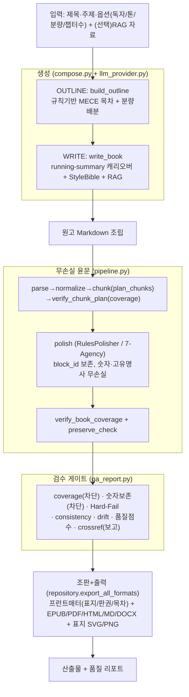
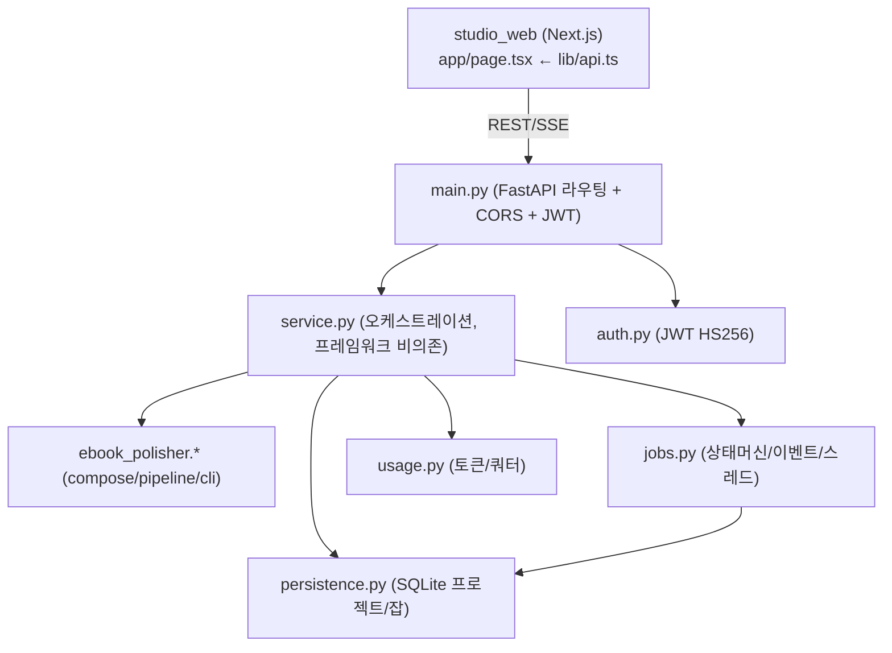

# 인수인계 문서 (HANDOVER) — OneClick eBook Studio / Ink&Press

최종 갱신: 2026-06-09 · 대상: 이 프로젝트를 **로컬 저장소에서 이어받아 개발할 개발자/AI**

> 이 문서 하나만 보고도 "지금까지 무엇을 했고, 구조와 로직이 어떻게 되며, 무엇을 이어서 하면 되는지"
> 를 파악할 수 있도록 작성했다. 더 깊은 내용은 각 섹션이 가리키는 `docs/` 문서를 본다.

---

## 0. 한 줄 정의

**제목 + 주제만 입력하면 → 목차 설계 → 본문 집필 → 무손실 윤문 → 품질 검수 → 조판 → EPUB/PDF/HTML/MD/DOCX 출력**까지
한 번에 수행하는 전자책 자동 제작·출판 스튜디오. 핵심 엔진은 **페이지/블록 원장 기반 "무손실(lossless)"** 설계이며,
LLM 없이도(오프라인·결정적) 전 기능이 동작하고, Claude 등 실제 LLM은 교체형 Provider로 연결한다.

현재 상태: **동작하는 MVP + 대규모 고도화 완료.** 테스트 **366개 통과**(엔진 288[+2 skip] + 스튜디오 78).
모든 모듈은 **표준 라이브러리만으로 동작**(외부 의존성은 선택적: fastapi/uvicorn은 API 구동 시, reportlab/python-docx는 PDF/DOCX 고품질 시).

---

## 1. 로컬에서 가장 먼저 할 일 (Quickstart)

```bash
# 1) 엔진 테스트 (외부 의존성 0)
cd apps/ebook_polisher && python3 -m unittest discover -s tests -p 'test_*.py'   # 288 (skip 2)

# 2) 스튜디오 서비스 테스트 (fastapi 불필요 — service 계층 직접)
cd apps/studio_api && python3 -m unittest discover -s tests -p 'test_*.py'        # 78

# 3) 엔진 CLI로 원고 윤문 (제목+주제 생성은 service.compose_book)
cd apps/ebook_polisher && python3 -m ebook_polisher.cli INPUT.md --out OUT

# 4) 제목+주제 → 완성본 (코드로)
cd apps/studio_api && python3 -c "import service; \
r=service.compose_book('제로존 입문','제로존 수학',n_chapters=5); \
print(r['ok'], r['qa']['evaluation']['grade'], list(r['files']))"

# 5) API 서버 (fastapi 설치 필요)
cd apps/studio_api && pip install -r requirements.txt && uvicorn main:app --port 8000
# 6) 웹 (node 필요)
cd apps/studio_web && npm install && npm run dev    # http://localhost:3000
```

테스트가 전부 초록이면 정상 인수받은 것이다. **무엇을 바꾸든 위 두 테스트 스위트를 항상 초록으로 유지**한다.

---

## 2. 저장소 구조

```
book/
├─ HANDOVER.md                  ← (이 문서)
├─ README.md                    ← 최상위 개요
├─ docs/                        ← 기획·설계·기술백서 (00~14 + oces/ 원문)
├─ apps/
│  ├─ ebook_polisher/           ← 핵심 엔진 (생성+윤문+검증+출력). 표준 라이브러리만.
│  │  ├─ ebook_polisher/        ← 패키지 (모듈 31개)
│  │  └─ tests/                 ← unittest (28개 파일, 288 테스트)
│  ├─ studio_api/               ← OCES 백엔드 (FastAPI + 순수 service 계층)
│  │  ├─ *.py (service/main/jobs/persistence/usage/auth)
│  │  └─ tests/                 ← unittest (9개 파일, 78 테스트)
│  ├─ studio_web/               ← OCES 프런트엔드 (Next.js 16 + React 19)
│  │  └─ app/ (page.tsx, lib/api.ts, components/*)
│  └─ ebook_publisher/          ← 출판 보조(국내외 14개 플랫폼 제출팩) + Hard-Fail 린터
└─ resources/
   ├─ checklist/                ← 600항목 윤문 체크리스트(원본 md + json + 빌더)
   ├─ hardfail/                 ← 금지어/상투어 사전
   └─ methodology/             ← 제로존 방법론 출처
```

---

## 3. 읽어야 할 문서 순서 (docs/)

| 우선 | 문서 | 왜 보는가 |
|---|---|---|
| ★1 | `docs/07_아키텍처v3_원장기반무손실엔진_통합백서.md` | **현재 엔진의 기준 설계.** 원장/Coverage Gate/세 겹 컨텍스트/검증 계층 |
| ★2 | `docs/09_OCES생성파이프라인_통합.md` | 제목+주제 → 책 **생성** 파이프라인(OUTLINE/WRITE)과 모듈 매핑 |
| ★3 | `docs/04_데이터모델_및_API명세.md` | 데이터 스키마·REST API·열거형 |
| 4 | `docs/02_윤문기엔진_상세설계서.md` | 윤문/600 체크리스트/정직 봉인 |
| 5 | `docs/06_아키텍처v2_제로존방법론통합백서.md` | 7-Agency/Hard-Fail/Lemma 철학 |
| 6 | `docs/10~14 (고도화 시리즈)` | 비동기잡·RAG·영속화·HITL·표지·JWT·조판·StyleBible·품질평가·상호참조·중간재개 |
| 참고 | `docs/oces/00~05` | OCES 원본 설계(외부 제공). 우리 구현의 출처 |
| 연혁 | `docs/00,01,03,05,08` | 초기 기획·아키텍처·로드맵·스튜디오 통합 |

문서 인덱스는 `docs/README.md`. 각 고도화 문서 끝에 "다음 단계"가 적혀 있다.

---

## 4. 전체 로직 (엔드투엔드 흐름)



**핵심 불변식 (절대 깨면 안 됨)**:
1. **페이지/블록 = 책임 단위, 청크 = 작업 단위.** 검증은 항상 block_id 기준.
2. **모든 윤문 출력은 입력 block_id를 1:1 보존.** (verifier가 강제)
3. **Coverage Gate**: source=parsed=polished=assembled 페이지 수 일치해야 출력 가능.
4. **숫자/ISBN/URL/고유명사 무손실.** preserve_check 위반 시 출판 차단(QA 게이트 04).
5. **rules 모드는 결정적**: 같은 입력 → 같은 출력(테스트가 의존).

---

## 5. 모듈 연결도 (의존 관계)

### 5.1 엔진 (`apps/ebook_polisher/ebook_polisher/`)

```mermaid
flowchart LR
  models["models.py (고정 계약: Block/Page/Chunk/PolishResult/Protocol)"]
  subgraph 생성
    llm["llm_provider.py (Stub/Anthropic, image)"]
    compose["compose.py (outline/write)"]
    style["style.py (StyleBible/glossary)"]
    rag["rag.py (벡터스토어)"]
    memory["memory.py · prompts.py"]
  end
  subgraph 윤문코어
    normalizer --> parser --> chunker --> verifier --> coverage_gate
    polisher["polisher.py (RulesPolisher)"]
    agents["agents.py (7-Agency)"]
    hardfail["hardfail.py"]
    repository["repository.py (SQLite 원장)"]
    pipeline["pipeline.py (오케스트레이션)"]
  end
  subgraph 검증
    consistency·drift·evaluate·crossref
  end
  subgraph 출력
    epub_export·minipdf·export·cover·frontmatter
  end
  compose --> llm
  compose --> style
  compose --> rag
  pipeline --> parser
  pipeline --> chunker
  pipeline --> verifier
  pipeline --> coverage_gate
  pipeline --> repository
  pipeline --> polisher
  repository --> qa_report["qa_report.py"]
  qa_report --> consistency
  qa_report --> drift
  qa_report --> evaluate
  qa_report --> crossref
  qa_report --> hardfail
  repository --> epub_export
  repository --> export
  export --> minipdf
  repository --> cover
  repository --> frontmatter
  cli["cli.py"] --> pipeline
  모든모듈 --> models
```

- `models.py`는 **동결 계약**이다. 바꾸면 거의 모든 모듈에 영향 → 신중히, 테스트 동반.
- `pipeline.py`가 윤문 오케스트레이션의 중심. `repository.py`가 원장·산출물·QA의 허브.
- 출력 포맷 추가는 `export.py`/`epub_export.py`에 함수 추가 + `repository.export_all_formats` 배선.

### 5.2 스튜디오 (`apps/studio_api/`)



- **`service.py`가 핵심 비즈니스 로직**이며 FastAPI 없이 단위 테스트된다(`tests/test_*`). `main.py`는 HTTP 바인딩만.
- 잡은 `jobs.JobStore`(인메모리) + persister 훅으로 SQLite 저장 → 재시작 복구.
- 사용자 스코프: `Authorization: Bearer <jwt>` 우선, 없으면 `X-User`, 없으면 `public`.

---

## 6. 핵심 계약/엔드포인트 요약

### 데이터 (engine `models.py`)
- `Block(block_id, page_id, order_index, block_type, text, polished_text, source_hash, status)`
- `Page`, `Chunk(primary_block_ids, overlap_block_ids, ...)`, `PolishResult(polished_blocks[])`
- id 형식: page_id=`pNNNNNN`, block_id=`bNNNNNN` (chunker가 의존). block_type ∈ {title,paragraph,quote,footnote,table,formula,caption}

### 주요 REST API (studio_api `main.py`)
```
GET  /health
POST /api/auth/token {user_id}            → JWT
POST /api/projects {title,topic,...}      → 프로젝트
GET  /api/projects | /api/projects/{id}
POST /api/compose/book {title,topic,...}  → 동기 풀 파이프라인(목차+집필+윤문+출력)
POST /api/projects/{id}/compose           → 비동기 잡 {job_id}
GET  /api/jobs/{id} | /api/jobs/{id}/stream(SSE)
POST /api/jobs/{id}/pause | /resume       → HITL/중간재개
GET  /api/projects/{id}/outline | /chapters
PATCH /api/chapters {project_id,idx,content_md}   → 인라인 편집(자동저장)
POST /api/chapters/regenerate {project_id,idx}    → 챕터 재생성
POST /api/projects/{id}/sources           → RAG 자료
GET  /api/projects/{id}/download/{fmt}     → epub|pdf|html|md|cover|cover_png
GET  /api/usage | /api/usage/dashboard
```

### 환경 변수
- `OCES_DB` : SQLite 경로(기본 `:memory:`; 로컬 운영은 파일 경로 권장, 예 `./oces.db`)
- `OCES_SECRET` : JWT 서명 비밀(기본 dev 값 — 운영 반드시 교체)
- `ANTHROPIC_API_KEY` : 설정 시 `provider="anthropic"`로 실제 Claude 사용 가능(미설정 시 StubProvider)

---

## 7. 지금까지 한 작업 (연혁)

커밋 타임라인(최신→과거)과 핵심 산출:

1. `02b9307` 상호참조 검증 + 잡 중간 재개
2. `193b299` 조판 프런트매터 + Style Bible + 품질 평가 점수
3. `5dd5af9` Claude 경로(주입식) + stdlib PDF 기본탑재 + JWT + 잡 영속화/복구 + PNG 표지/삽화
4. `50d69c7` 영속화(SQLite) + HITL 일시정지/재개 + 인라인 편집 + 표지 + 멀티테넌시 + 비용
5. `0647903` 비동기 잡 + SSE + 챕터 재생성 + RAG + 다중포맷 + 제품 UI/UX
6. `573ca88` OCES 생성 파이프라인(제목+주제 → EPUB)
7. `6eff0f7` EPUB3/HTML 출력 + consistency + drift
8. `bd766b7` OneClick eBook Studio(껍데기) 통합 → 엔진 배선
9. `cba58b1`~`7aa5434` v3 원장 엔진 구현 + QA + 재개 + 검수 반영
10. `410b0b6`~`c189481` v2 제로존 방법론 + 600 체크리스트 + 초기 기획/백서

기능 누적: 생성(목차·집필·StyleBible·RAG) · 무손실 윤문 · 검증(coverage/preserve/consistency/drift/crossref/품질/HardFail) ·
출력(EPUB/PDF/HTML/MD/DOCX · SVG/PNG 표지 · 프런트매터) · 운영(비동기잡/SSE/HITL/중간재개/영속화/JWT/멀티테넌시/비용) · 제품 UI.

---

## 8. 앞으로 할 작업 (백로그 · 우선순위)

> 각 항목은 "오프라인·결정적·테스트 동반" 원칙을 지킬 것. 외부 의존성은 선택적·graceful.

### P1 — 품질/출력 완성도
- [ ] **고품질 한글 PDF**: `reportlab` + Noto/나눔 CJK 폰트 임베드(현재 minipdf는 한글이 `?`). `export.blocks_to_pdf` 경로 강화. (의존성 설치 필요)
- [ ] **표지 PNG에 제목 텍스트 렌더**: 현재 cover_png는 추상 그라데이션(텍스트 없음). CJK 비트맵/폰트 렌더 또는 SVG→PNG(cairosvg) 연결.
- [ ] **상호참조/일관성 위반 자동 수정 루프**: crossref/consistency 위반을 프롬프트 피드백으로 재집필(self-refine, OCES 03 §5).

### P2 — 생성 품질(실 LLM)
- [ ] **AnthropicProvider 실연동 테스트**(키 주입 환경) + 비용/토큰 실측 반영.
- [ ] **LLM-as-judge 평가 옵션**(evaluate.py에 실모델 루브릭 채점 추가, 기본은 현재 자동지표).
- [ ] **분량 적합 강화**: 챕터 목표 분량 미달/초과 시 재생성(evaluate.length_adherence 연동).

### P3 — 운영/확장
- [ ] **잡 이벤트 SSE 실제 프런트 연결**(현재 폴링) + 잡 영속 복구 후 재구독.
- [ ] **CSV/SQLite ↔ PostgreSQL 마이그레이션**(persistence는 동일 스키마라 승격 경로 확보됨).
- [ ] **ebook_publisher 연결**: compose 산출(EPUB/메타) → 14개 플랫폼 제출팩 자동 생성(원클릭 출판까지).
- [ ] **파일 업로드(DOCX/PDF/EPUB) 파서**: 현재 parser는 txt/md. PyMuPDF/python-docx/ebooklib 어댑터 추가(선택 의존성).

### P4 — 통합 E2E/품질 보증
- [ ] **API 통합 E2E**: fastapi TestClient로 라우팅까지 테스트(설치 필요).
- [ ] **웹 빌드 점검**: `npm run build` 통과 확인(node 필요), 컴포넌트 타입 점검.

---

## 9. 개발 규칙 (이 프로젝트의 관례)

1. **테스트 우선**: 새 모듈은 `tests/test_<name>.py`(unittest) 동반, 두 스위트 항상 초록.
2. **표준 라이브러리 우선**: 코어는 의존성 0. 외부 라이브러리는 lazy import + 없으면 graceful(예: PDF/DOCX, fastapi).
3. **결정성**: 같은 입력 → 같은 출력(LLM 미사용 시). 회귀 테스트가 이에 의존.
4. **게이트 존중**: 무결성(coverage)·무손실(preserve)·600 체크리스트·Hard-Fail은 "차단", 나머지(consistency/drift/품질/crossref)는 "정직 보고".
5. **계약 동결**: `models.py`(engine), `service.py` 시그니처 변경은 파급이 크다 — 신중히.
6. **모듈 소유 분리**: 한 기능 = 한 모듈 + 한 테스트. 병렬 작업 시 파일 겹침 금지.

---

## 10. 로컬 전환 시 주의사항

- 이제부터 **GitHub가 아니라 로컬 저장소에서 작업**한다. 원격 푸시는 사용자가 지시할 때만.
  - 기존 작업 브랜치: `claude/gallant-hopper-kGgs8` (원격에 최신까지 반영됨). 로컬에서 새 브랜치를 파거나 이어서 작업.
- `.gitignore`가 산출물(EPUB/PDF/PNG/DB/node_modules/.next/out)을 제외한다 — 산출물은 커밋하지 말 것.
- 외부 라이브러리 미설치 환경에서도 **엔진/서비스 테스트는 전부 통과**해야 정상(2개 skip은 docx/pdf 고품질 경로로 정상).
- API/웹 구동에는 각각 `pip install -r apps/studio_api/requirements.txt`, `npm install`이 필요(코어 로직 검증에는 불필요).

---

## 11. "막히면 여기부터"

- 윤문이 깨진다 → `pipeline.py` + `verifier.py`(coverage/preserve) + `repository.build_chunk_payload`.
- 생성 결과가 이상 → `compose.py`(outline/write) + `llm_provider.py`(provider) + `style.py`.
- 출력 파일 문제 → `repository.export_all_formats` + `epub_export.py`/`export.py`/`minipdf.py`/`frontmatter.py`.
- 잡/진행/재개 → `jobs.py` + `service.start_compose_job/resume_job` + `persistence.py`.
- 인증/사용자 격리 → `auth.py` + `main._uid` + `service.get_project(user_id=...)`.
- QA 점수/게이트 → `qa_report.py` + `evaluate/consistency/drift/crossref/hardfail`.

행운을 빈다. 무엇을 바꾸든 **두 테스트 스위트를 초록으로** 유지하면 안전하다.
