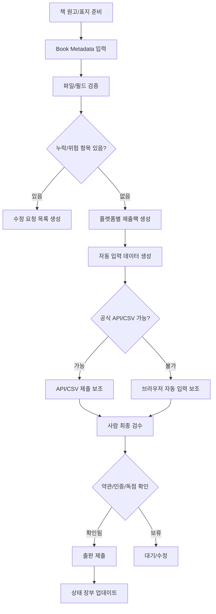

# 원클릭 전자책 출판 오토매크로 시스템 기술백서

작성일: 2026-06-07  
작업 폴더: `C:\Users\ATA\Documents\총정리\전자책_출판자동화`

## 1. 한 줄 정의

이 시스템은 전자책 원고, 표지, 책 소개, 가격, ISBN, 권리정보, AI 사용 고지, 플랫폼별 약관 체크 항목을 한 번만 입력하면 국내외 전자책 사이트별 제출팩, 자동 입력 데이터, 진행상태표, 최종 검수 체크리스트를 생성하는 출판 운영 자동화 시스템이다.

## 2. 왜 완전 무인 자동가입은 위험한가

사용자가 원하는 최종 모습은 "책을 만들면 버튼 한 번으로 모든 사이트에 가입하고 모든 사이트에 책을 등록하는 시스템"이다. 기술적으로 브라우저 자동화 도구는 입력창에 값을 넣고 버튼을 누를 수 있다. 하지만 출판 플랫폼에는 다음 단계가 있어 완전 무인 처리가 위험하다.

- 휴대폰 본인인증
- 이메일 인증
- CAPTCHA
- 사업자등록번호 또는 출판사 신고 정보 확인
- 세금 정보 입력
- 정산 계좌 입력
- 약관 동의
- 독점 계약 선택
- AI 생성 콘텐츠 고지
- 저작권 보유 확인
- 성인/민감 콘텐츠 심사
- 최종 출판 버튼

따라서 이 기술백서는 "약관을 우회하는 무인 자동가입"이 아니라, "사람의 승인과 법적 책임이 필요한 지점은 멈추고, 반복 입력과 자료 준비만 자동화하는 원클릭 출판 보조 시스템"을 기준으로 한다.

## 3. 시스템 이름

권장 이름: `OneClick Ebook Publisher`

한국어 이름: `전자책 원클릭 출판센터`

내부 모듈명:

- `BookVault`: 원고/표지/ISBN/메타데이터 보관
- `PublisherHub`: 플랫폼별 등록 규칙 관리
- `SubmissionPack`: 사이트별 제출자료 생성
- `BrowserAssistant`: 브라우저 자동 입력 보조
- `ComplianceGate`: 약관/인증/독점/AI 고지 확인
- `StatusLedger`: 등록 상태 장부
- `ReviewDesk`: 최종 검수 화면

## 4. 국내외 전자책 플랫폼 분류

### 4.1 해외 직접 등록 플랫폼

| 플랫폼 | 성격 | 자동화 가능 수준 | 핵심 주의점 |
|---|---|---:|---|
| Amazon KDP | 직접 출판 | 높음, 최종 제출은 수동 | KDP Select 선택 시 90일 전자책 독점 관리 필요 |
| Google Play Books Partner Center | 직접 출판 | 중간 | 세금/결제/권리지역 설정 필요 |
| Apple Books for Authors | 직접 또는 파트너 | 중간 | EPUB 직접 등록 권장, iTunes Connect 필요 |
| Kobo Writing Life | 직접 출판 | 높음 | 비독점 가능, OverDrive/Kobo Plus 선택 관리 |
| Gumroad | 직접 판매 | 높음 | 전자책 파일 직접 판매, 세금/VAT/환불정책 확인 |
| Payhip | 직접 판매 | 높음 | 자체 스토어형 판매에 적합 |

### 4.2 해외 배급사/중개 플랫폼

| 플랫폼 | 성격 | 자동화 가능 수준 | 핵심 주의점 |
|---|---|---:|---|
| Draft2Digital | 전자책 배급 | 중간~높음 | 여러 스토어 동시 배급, 직접 등록 채널과 중복 방지 |
| PublishDrive | 다중 스토어 배급 | 중간 | 요금제와 배급 채널 확인 |
| IngramSpark | POD/글로벌 배급 | 중간 | 종이책/POD에 강점, Amazon 중복 유통 주의 |

### 4.3 국내 서점/플랫폼

| 플랫폼 | 성격 | 자동화 가능 수준 | 핵심 주의점 |
|---|---|---:|---|
| 교보문고 | 서점/CP 입점 | 낮음~중간 | 출판사/공급사 계약 구조 가능성 높음 |
| YES24 | 도서/eBook 신규거래 | 낮음~중간 | 공식 신규거래 신청 경로, SCM 계정 |
| 알라딘 | 전자책 신규 거래 | 낮음~중간 | 전자책 담당자/신규 거래 신청서 중심 |
| 리디 | 콘텐츠 제휴/입점 | 낮음~중간 | 파트너 심사 및 계약 필요 |
| 네이버 스마트스토어 | 직접 판매 | 중간 | 디지털 상품 정책, 고객 응대, 배송/다운로드 방식 확인 |

## 5. 출판 전 필수 준비물

한 권의 책마다 아래 정보가 있어야 한다.

| 구분 | 필수 여부 | 설명 |
|---|---:|---|
| 책 ID | 필수 | 내부 관리용 고유값. 예: `zerozone_001` |
| 제목 | 필수 | 표지와 플랫폼 메타데이터가 일치해야 함 |
| 부제 | 권장 | 검색/설명력 보강 |
| 저자명 | 필수 | 실명 또는 필명 |
| 출판사명 | 국내 권장 | 국내 입점 시 중요 |
| 언어 | 필수 | `ko`, `en` 등 |
| 긴 소개문 | 필수 | 상세페이지용 |
| 짧은 소개문 | 권장 | 목록/광고/요약용 |
| 키워드 | 필수 | 플랫폼별 검색어 |
| 카테고리 | 필수 | 플랫폼별 장르 매핑 필요 |
| 원고 파일 | 필수 | DOCX, EPUB, PDF 등 |
| 표지 파일 | 필수 | JPG/PNG, 플랫폼별 권장 해상도 |
| ISBN | 선택/권장 | KDP eBook은 미필수이나 국내/종이책은 중요 |
| 가격 | 필수 | KRW/USD 등 |
| 권리지역 | 필수 | 전세계 또는 국가별 |
| AI 사용 고지 | 필수 검토 | 플랫폼별 AI 콘텐츠 정책 대응 |
| 성인/민감 콘텐츠 여부 | 필수 검토 | 심사/노출 제한에 영향 |
| KDP Select 여부 | 필수 검토 | 독점 충돌 방지 |

## 6. 원클릭의 실제 의미

시스템에서 "원클릭"은 아래 7개 작업을 한 번에 수행한다는 뜻이다.

1. 책 메타데이터 검증
2. 원고/표지 파일 존재 확인
3. 플랫폼별 누락 항목 탐지
4. 제출팩 생성
5. 플랫폼별 입력용 JSON 생성
6. 등록 대기열 생성
7. 사람이 승인해야 할 지점 표시

최종 출판 버튼까지 무조건 자동으로 누르는 것은 기본값으로 금지한다. 법적 책임과 약관 동의가 있기 때문이다.

## 7. 전체 처리 흐름



## 8. 데이터 표준

시스템의 중심은 CSV가 아니라 "표준 책 객체"다. CSV는 사람이 편하게 편집하는 입력 형식이고, 내부에서는 JSON 객체로 바뀐다.

```json
{
  "book_id": "zerozone_001",
  "title": "제로존 0=0 없음은 없다",
  "subtitle": "수학과 존재론을 잇는 대중 교양 전자책",
  "author": "ATA",
  "language": "ko",
  "description": "상세 소개문",
  "keywords": ["제로존", "수학", "철학"],
  "categories": ["Science/Mathematics", "Philosophy"],
  "files": {
    "manuscript": "path/to/book.docx",
    "cover": "path/to/cover.jpg",
    "sample": "path/to/sample.epub"
  },
  "pricing": {
    "KRW": 12000,
    "USD": 9.99
  },
  "rights": {
    "territories": "world",
    "exclusive": false
  },
  "compliance": {
    "ai_disclosure": "needs_review",
    "adult_content": false,
    "copyright_owner_confirmed": true
  }
}
```

## 9. 플랫폼별 등록 전략

### 9.1 Amazon KDP

권장 자동화:

- 책 제목/부제/저자명 자동 입력
- 소개문 자동 입력
- 키워드 자동 입력
- 카테고리 후보 표시
- 원고/표지 업로드 보조
- 가격 자동 입력 보조
- KDP Select 체크 여부를 별도 경고로 표시

사람 확인:

- 출판 권리 확인
- AI 콘텐츠 고지
- 미리보기 오류 확인
- KDP Select 독점 동의
- 최종 출판 버튼

### 9.2 Draft2Digital

권장 자동화:

- 배급할 스토어 체크리스트 생성
- KDP 직접 등록 시 Amazon 배급 제외 경고
- EPUB/DOCX 업로드 준비
- 가격/권리지역 일괄 입력 보조

사람 확인:

- 배급 채널 선택
- ISBN 사용 범위
- 정산 정보
- 최종 Publish

### 9.3 Google Play Books

권장 자동화:

- Book Catalog 추가용 메타데이터 생성
- 파일 업로드 전 EPUB/PDF 검증
- 국가별 가격표 생성

사람 확인:

- Partner Center 프로필
- 지급/세금 정보
- 국가별 판매 가능 여부

### 9.4 Apple Books

권장 자동화:

- EPUB 중심 제출팩 생성
- iTunes Connect 입력 보조
- Apple Books 상품페이지용 소개문 생성

사람 확인:

- Apple 계정/계약/세금 정보
- EPUB 검수
- 최종 제출

### 9.5 Kobo Writing Life

권장 자동화:

- 책 정보 입력 보조
- 가격/권리/라이선스 입력 보조
- OverDrive/Kobo Plus 선택 표시

사람 확인:

- 구독/도서관 배급 여부
- 최종 Publish

### 9.6 국내 4대 채널

국내는 "출판사/공급사 거래"가 핵심이다.

권장 자동화:

- 거래 신청서용 출판사 정보 묶음 생성
- 책별 도서정보서 생성
- 원고/표지/ISBN/가격표 제출 폴더 생성
- 담당자 이메일 초안 생성
- 입점 진행 상태 추적

사람 확인:

- 사업자 정보
- 출판사 신고
- 계약서
- 정산 계좌
- 인감/서명
- 공급률/배분율

## 10. 보안 설계

절대 하지 말아야 할 것:

- 사이트 비밀번호를 평문 CSV에 저장
- 주민등록번호/계좌번호를 일반 텍스트로 저장
- CAPTCHA 우회 시도
- 본인인증 자동 우회
- 약관 동의를 자동 클릭
- 독점계약을 자동 선택

권장 방식:

- 비밀번호는 브라우저 또는 OS 암호 저장소 사용
- 민감정보는 입력 직전 화면에서만 표시
- 계좌/세금 정보는 "준비 완료 여부"만 장부에 기록
- 모든 최종 제출은 사람 승인 로그 남김
- 플랫폼별 약관 변경 시 레지스트리 업데이트

## 11. 개발 단계

### 1단계: 제출팩 생성기

현재 구현됨.

- `platform_registry.csv`
- `book_metadata_template.csv`
- `scripts/generate_submission_pack.py`

### 2단계: 상태 장부

추가할 파일:

- `publication_status.csv`
- `publisher_accounts.csv`
- `submission_queue.csv`

### 3단계: 로컬 대시보드

HTML/JS 기반 화면.

- 책 목록
- 플랫폼 목록
- 누락 항목
- 원클릭 제출팩 생성 버튼
- 플랫폼별 진행 상태
- 위험 경고

### 4단계: 브라우저 자동 입력

Playwright 또는 Selenium 사용.

기본 원칙:

- 로그인은 사용자가 직접
- 입력 자동화는 허용
- 최종 제출 버튼 앞에서 정지
- CAPTCHA/본인인증은 사용자가 직접

### 5단계: 국내 신청서 자동 채움

국내 거래 신청서 양식을 확보한 뒤:

- 엑셀 자동 입력
- PDF 폼 자동 입력
- 이메일 초안 생성
- 제출 자료 ZIP 생성

## 12. 성공 기준

시스템이 성공했다고 말할 수 있는 기준:

- 새 책 1권을 `book_metadata.csv`에 추가하면 제출팩이 자동 생성된다.
- 원고/표지 누락이 바로 표시된다.
- KDP Select 독점 충돌이 경고된다.
- 국내 플랫폼은 신청서/메일/첨부 폴더가 자동 생성된다.
- 해외 플랫폼은 브라우저 자동 입력용 JSON이 생성된다.
- 사람이 최종 검수해야 할 지점이 명확히 분리된다.
- 등록 후 판매 URL과 심사 상태가 장부에 남는다.

## 13. 참고 링크

- Amazon KDP: https://kdp.amazon.com/
- KDP Metadata Guidelines: https://kdp.amazon.com/en_US/help/topic/G201097560
- KDP Select: https://kdp.amazon.com/en_US/help/topic/G200798990
- Google Play Books Partner Center: https://support.google.com/books/partner/
- Apple Books for Authors: https://authors.apple.com/publish
- Kobo Writing Life: https://www.kobo.com/writinglife
- Draft2Digital: https://www.draft2digital.com/
- IngramSpark: https://www.ingramspark.com/
- YES24 신규거래: https://m.yes24.com/Company/Scm/eBookBusiness
- 알라딘 전자책 신규 거래 신청: https://t.aladin.co.kr/ucl_editor/supplier/NoticeAttach/%EC%95%8C%EB%9D%BC%EB%94%98%20%EC%A0%84%EC%9E%90%EC%B1%85%20%EC%8B%A0%EA%B7%9C%20%EA%B1%B0%EB%9E%98%20%EC%8B%A0%EC%B2%AD.pdf
