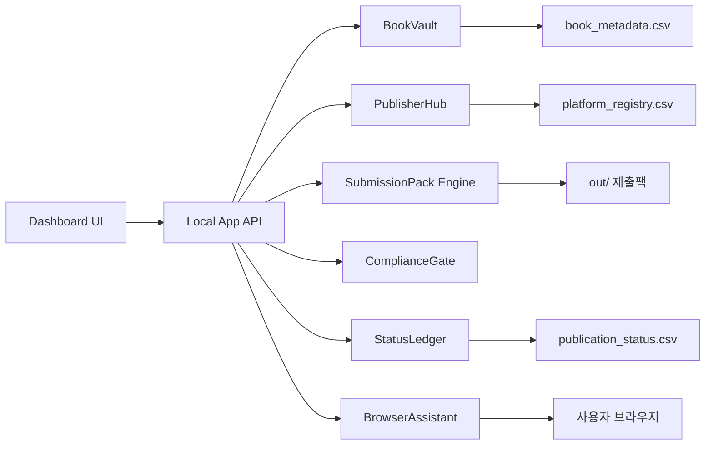
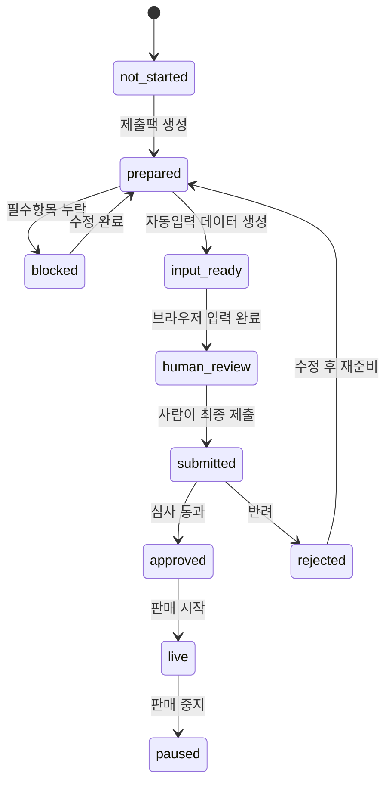

# 시스템 아키텍처 및 프로그램 기획서

## 1. 제품 목적

`OneClick Ebook Publisher`는 전자책을 여러 플랫폼에 반복 등록하는 과정을 표준화하고, 사람이 매번 복사/붙여넣기 하던 일을 자동화한다. 개발 목표는 "출판 가능한 상태의 책 1권"을 "플랫폼별 제출 가능한 패키지"로 바꾸는 것이다.

## 2. 사용자 유형

| 사용자 | 역할 | 필요한 기능 |
|---|---|---|
| 저자 | 원고 작성자 | 책 정보 입력, 진행상태 확인 |
| 출판 담당자 | 플랫폼 등록 담당 | 제출팩 검수, 브라우저 자동 입력 |
| 관리자 | 전체 운영자 | 플랫폼 규칙 관리, 계정 상태 관리 |
| 검수자 | 품질/법무 확인 | 저작권, AI 고지, 독점 충돌 검토 |

## 3. 핵심 사용자 시나리오

### 시나리오 A: 새 책 등록 준비

1. 사용자가 새 책 원고와 표지를 준비한다.
2. 대시보드에서 `새 책 추가`를 누른다.
3. 제목, 저자, 소개문, 가격, 키워드, 파일 경로를 입력한다.
4. 시스템이 필수 항목 누락과 파일 존재 여부를 검사한다.
5. 문제가 없으면 `출판 준비 완료` 상태가 된다.

### 시나리오 B: 모든 사이트 제출팩 생성

1. 사용자가 책을 선택한다.
2. `전체 플랫폼 제출팩 생성`을 누른다.
3. 시스템이 플랫폼별 Markdown, JSON, 체크리스트를 만든다.
4. 각 플랫폼 카드에 `준비 완료`, `추가 확인 필요`, `계약 필요` 상태가 표시된다.

### 시나리오 C: KDP 자동 입력 보조

1. 사용자가 Amazon KDP에 직접 로그인한다.
2. 시스템에서 `KDP 입력 시작`을 누른다.
3. 브라우저 자동화가 제목, 소개문, 키워드, 가격 등을 입력한다.
4. AI 고지, KDP Select, 최종 Publish 앞에서 멈춘다.
5. 사용자가 직접 확인하고 제출한다.

### 시나리오 D: 국내 서점 입점 준비

1. 사용자가 교보/YES24/알라딘/리디 플랫폼을 선택한다.
2. 시스템이 출판사 정보, 책 정보, 원고/표지, 가격표, ISBN 정보를 묶는다.
3. 신청서 양식이 있으면 자동 채움 파일을 만든다.
4. 담당자 이메일 초안을 생성한다.
5. 사용자가 계약/인증/서명 후 직접 제출한다.

## 4. 모듈 구성



## 5. 폴더 구조

```text
전자책_출판자동화/
  README.md
  00_원클릭_전자책출판_기술백서.md
  01_시스템_아키텍처_프로그램기획서.md
  02_UX_UI_상세설계서.md
  book_metadata_template.csv
  platform_registry.csv
  publication_status_template.csv
  publisher_accounts_template.csv
  submission_queue_template.csv
  scripts/
    generate_submission_pack.py
    validate_book_metadata.py
    build_submission_queue.py
    browser_fill_kdp.py
  ui/
    one_click_publisher_dashboard.html
  out/
    submission_manifest.json
    {book_id}/
      amazon_kdp.md
      amazon_kdp.json
      yes24.md
      yes24.json
```

## 6. 데이터베이스 설계

초기 버전은 SQLite보다 CSV/JSON이 좋다. 사용자가 눈으로 보고 수정하기 쉽기 때문이다. 나중에 책이 100권 이상이 되면 SQLite로 전환한다.

### 6.1 `books`

| 필드 | 타입 | 설명 |
|---|---|---|
| book_id | string | 내부 고유 ID |
| title | string | 제목 |
| subtitle | string | 부제 |
| author | string | 저자명 |
| language | string | 언어 |
| description | text | 긴 소개문 |
| keywords | list | 검색 키워드 |
| categories | list | 장르 |
| manuscript_path | path | 원고 파일 |
| cover_path | path | 표지 파일 |
| price_krw | number | 원화 가격 |
| price_usd | number | 달러 가격 |
| kdp_select | boolean | KDP Select 여부 |
| ai_disclosure | enum | AI 고지 상태 |

### 6.2 `platforms`

| 필드 | 타입 | 설명 |
|---|---|---|
| platform_id | string | 플랫폼 ID |
| region | enum | `kr`, `global` |
| platform_name | string | 표시명 |
| entry_type | enum | 직접출판/배급/입점계약/직접판매 |
| automation_level | enum | 자동화 수준 |
| preferred_route | text | 권장 등록 경로 |
| notes | text | 주의점 |

### 6.3 `publication_status`

| 필드 | 타입 | 설명 |
|---|---|---|
| book_id | string | 책 ID |
| platform_id | string | 플랫폼 ID |
| status | enum | `not_started`, `prepared`, `submitted`, `approved`, `live`, `rejected`, `paused` |
| last_action | text | 마지막 작업 |
| platform_url | url | 판매/관리 URL |
| reviewer_note | text | 심사/수정 메모 |
| updated_at | datetime | 갱신 시각 |

### 6.4 `publisher_accounts`

| 필드 | 타입 | 설명 |
|---|---|---|
| platform_id | string | 플랫폼 ID |
| account_status | enum | `not_created`, `created`, `verified`, `tax_ready`, `payment_ready`, `blocked` |
| login_hint | string | 로그인 힌트. 비밀번호 금지 |
| tax_ready | boolean | 세금 정보 준비 여부 |
| payment_ready | boolean | 정산 정보 준비 여부 |
| contract_status | enum | `none`, `requested`, `reviewing`, `signed` |

## 7. 상태 머신

책과 플랫폼의 조합마다 아래 상태를 가진다.



## 8. 자동화 레벨 정의

| 레벨 | 이름 | 설명 |
|---:|---|---|
| 0 | 수동 | 링크와 체크리스트만 제공 |
| 1 | 제출팩 자동 생성 | Markdown/JSON/ZIP 생성 |
| 2 | 양식 자동 채움 | CSV/엑셀/PDF 신청서 자동 작성 |
| 3 | 브라우저 자동 입력 | 로그인 이후 입력창 자동 채움 |
| 4 | API 제출 | 공식 API나 승인된 대량 업로드 |
| 5 | 최종 제출 자동화 | 기본 금지. 공식 API와 명시 승인 있을 때만 |

## 9. 프로그램 화면 목록

| 화면 | 목적 |
|---|---|
| 대시보드 | 전체 책/플랫폼 진행률 |
| 책 등록 화면 | 책 메타데이터 입력 |
| 플랫폼 레지스트리 | 사이트별 규칙 관리 |
| 제출팩 생성 화면 | 원클릭 제출팩 생성 |
| 검수 화면 | 누락/위험/독점 충돌 확인 |
| 자동 입력 화면 | 브라우저 입력 보조 시작 |
| 상태 장부 화면 | 등록/심사/판매 URL 관리 |
| 계정 준비 화면 | 플랫폼별 가입/계약/정산 준비 상태 |

## 10. API 설계

초기 로컬 앱 기준 API.

| 메서드 | 경로 | 기능 |
|---|---|---|
| GET | `/books` | 책 목록 |
| POST | `/books` | 책 추가 |
| GET | `/platforms` | 플랫폼 목록 |
| POST | `/validate/{book_id}` | 책 검증 |
| POST | `/packs/{book_id}` | 제출팩 생성 |
| POST | `/queue/{book_id}` | 등록 대기열 생성 |
| POST | `/browser/kdp/{book_id}` | KDP 자동 입력 시작 |
| PATCH | `/status/{book_id}/{platform_id}` | 상태 갱신 |

## 11. 브라우저 자동화 규칙

1. 사용자가 브라우저에서 직접 로그인한다.
2. 자동화는 로그인 세션을 이용하되 비밀번호를 다루지 않는다.
3. CAPTCHA가 나오면 즉시 멈춘다.
4. 본인인증이 나오면 즉시 멈춘다.
5. 약관 동의 체크박스는 자동 클릭하지 않는다.
6. 독점 계약 체크박스는 자동 클릭하지 않는다.
7. 최종 제출 버튼 앞에서 정지한다.
8. 입력한 값과 원본 메타데이터를 비교한 검수표를 보여준다.

## 12. 에러 처리

| 에러 | 원인 | 사용자에게 보여줄 말 |
|---|---|---|
| `missing_manuscript` | 원고 파일 없음 | 원고 파일 경로가 없습니다 |
| `missing_cover` | 표지 파일 없음 | 표지 파일 경로가 없습니다 |
| `missing_required_metadata` | 필수 메타데이터 누락 | 제목/저자/소개문/가격을 확인하세요 |
| `exclusive_conflict` | KDP Select와 외부 배급 충돌 | 이 책은 독점 설정 때문에 다른 전자책 판매처 등록을 멈춰야 합니다 |
| `account_not_ready` | 계정/세금/정산 미완료 | 먼저 플랫폼 계정 준비를 끝내야 합니다 |
| `human_gate_required` | 사람 승인 필요 | 약관/인증/최종 제출은 직접 확인해야 합니다 |

## 13. 개발 우선순위

1. 현재 CSV 기반 제출팩 생성기를 안정화한다.
2. `publication_status_template.csv`를 추가한다.
3. UI 대시보드에서 CSV를 읽어 진행률을 보여준다.
4. KDP 자동 입력 스크립트를 만든다.
5. Draft2Digital 자동 입력 스크립트를 만든다.
6. 국내 거래 신청서 자동 채움 모듈을 만든다.
7. 계정 준비 상태와 계약 상태를 대시보드에 붙인다.
8. 전체 작업을 `원클릭 준비` 버튼으로 묶는다.

## 14. MVP 완성 기준

MVP는 아래가 되면 완성으로 본다.

- 책 1권 메타데이터 입력 가능
- 국내/해외 10개 이상 플랫폼 레지스트리 존재
- 제출팩 자동 생성
- 플랫폼별 누락/주의 항목 표시
- 상태 장부 기록 가능
- HTML 대시보드에서 책과 플랫폼 상태 확인
- KDP 자동 입력 전용 JSON 생성

## 15. 장기 버전

장기 버전은 다음까지 확장한다.

- EPUB 자동 생성
- 표지 자동 리사이즈
- 책 소개문 플랫폼별 문체 변환
- 가격 자동 환산
- ISBN/권리지역/독점 충돌 자동 검사
- 판매 URL 수집
- 매출 데이터 수집
- 광고 문구 생성
- 개정판 업로드 관리
- 시리즈물 일괄 관리
