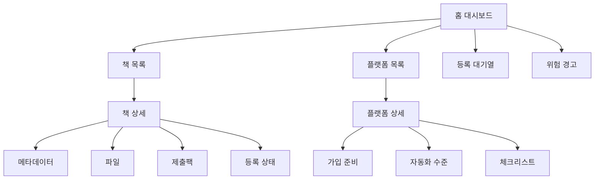

# UX/UI 상세 설계서

## 1. UX 목표

이 프로그램의 UX 목표는 사용자가 전자책 출판 과정을 머릿속에 다 기억하지 않아도 되게 만드는 것이다. 사용자는 "책을 선택하고, 누락된 것을 채우고, 안전한 버튼을 누르는" 방식으로 움직인다.

핵심 문장:

> 사용자는 출판 플랫폼 전문가가 아니어도 된다. 시스템이 다음에 해야 할 일을 화면에 보여준다.

## 2. UX 원칙

1. 먼저 위험을 보여준다.
2. 그 다음 할 수 있는 버튼을 보여준다.
3. 최종 제출은 사람이 확인하게 한다.
4. 사이트별 용어 차이는 시스템이 번역한다.
5. 입력은 한 번, 변환은 여러 번 한다.
6. 진행 상태는 책 기준과 플랫폼 기준으로 모두 볼 수 있어야 한다.

## 3. 정보 구조



## 4. 화면 1: 홈 대시보드

목적:

- 오늘 무엇을 해야 하는지 한눈에 보여준다.

구성:

- 상단 요약 카드
  - 전체 책 수
  - 출판 준비 완료 책 수
  - 제출 대기 플랫폼 수
  - 사람 확인 필요 항목 수
- 왼쪽: 책 목록
- 가운데: 선택한 책의 플랫폼별 진행률
- 오른쪽: 위험 경고와 다음 행동

버튼:

- `새 책 추가`
- `제출팩 생성`
- `전체 검수`
- `자동 입력 시작`
- `상태 내보내기`

## 5. 화면 2: 책 등록/수정

필드 그룹:

- 기본 정보
  - 책 ID
  - 제목
  - 부제
  - 저자
  - 필명
  - 언어
- 소개/검색
  - 긴 소개문
  - 짧은 소개문
  - 키워드
  - 카테고리
- 파일
  - 원고
  - 표지
  - 샘플
- 가격/권리
  - 원화 가격
  - 달러 가격
  - 권리지역
  - 독점 여부
- 정책
  - AI 사용 고지
  - 성인 콘텐츠 여부
  - 저작권 보유 확인

검증 메시지:

- 빨간색: 출판 불가
- 노란색: 사람 확인 필요
- 초록색: 준비 완료

## 6. 화면 3: 플랫폼 레지스트리

목적:

- 어떤 사이트에 어떤 방식으로 등록할지 관리한다.

표 컬럼:

- 플랫폼명
- 국내/해외
- 직접출판/배급/입점계약
- 자동화 수준
- 계정 상태
- 계약 상태
- 마지막 업데이트

플랫폼 상세에서 보여줄 내용:

- 사이트 URL
- 권장 등록 경로
- 필수 준비물
- 자동화 가능한 항목
- 사람이 해야 하는 항목
- 중복 유통 주의사항

## 7. 화면 4: 제출팩 생성

목적:

- 책 1권을 선택하고 여러 플랫폼 제출자료를 한 번에 만든다.

화면 흐름:

1. 책 선택
2. 플랫폼 선택
3. 검증 실행
4. 위험 항목 표시
5. 제출팩 생성
6. 결과 폴더 열기

결과 표시:

- 생성된 Markdown 수
- 생성된 JSON 수
- 파일 누락 수
- 정책 확인 필요 수

## 8. 화면 5: 검수 화면

목적:

- 최종 제출 전에 실수와 위험을 막는다.

검수 항목:

- 제목과 표지 제목 일치
- 저자명 일치
- 소개문 과장/오해 가능성
- AI 고지 필요 여부
- KDP Select 독점 충돌
- ISBN 중복 사용
- 가격 통화 누락
- 원고 파일 미리보기
- 표지 파일 해상도
- 국내 입점 서류 누락

## 9. 화면 6: 자동 입력 화면

목적:

- 브라우저 자동화를 시작하고 멈춰야 할 지점을 보여준다.

구성:

- 플랫폼 선택
- 책 선택
- 자동 입력 예정 필드 목록
- 자동 입력 불가 필드 목록
- 사람 확인 게이트 목록
- `브라우저 열기`
- `입력 시작`
- `멈춤`
- `검수 완료 표시`

중요 문구:

- "약관 동의와 최종 제출은 자동으로 누르지 않습니다."
- "본인인증이나 CAPTCHA가 나오면 자동화가 멈춥니다."
- "KDP Select는 독점 계약이므로 직접 확인해야 합니다."

## 10. 화면 7: 상태 장부

목적:

- 어떤 책이 어느 사이트에 어디까지 갔는지 관리한다.

상태값:

- 시작 전
- 제출팩 생성
- 계정 준비 필요
- 입력 대기
- 사람 검수 필요
- 제출 완료
- 심사 중
- 승인
- 판매 중
- 반려
- 보류

필드:

- 책 ID
- 플랫폼
- 상태
- 마지막 작업
- 판매 URL
- 관리자 URL
- 반려 사유
- 다음 행동
- 업데이트 날짜

## 11. UI 색상 체계

| 상태 | 색상 | 의미 |
|---|---|---|
| 초록 | 준비 완료/판매 중 | 진행 가능 |
| 노랑 | 사람 확인 필요 | 자동화 중지점 |
| 빨강 | 오류/누락/충돌 | 수정 전 진행 금지 |
| 파랑 | 정보/대기 | 참고 또는 준비 중 |
| 회색 | 시작 전 | 아직 작업 없음 |

## 12. 버튼 UX

버튼은 사용자가 착각하지 않도록 이름을 정확히 붙인다.

좋은 버튼명:

- `제출팩 생성`
- `파일 검증`
- `KDP 입력 보조 시작`
- `최종 검수 완료로 표시`
- `국내 입점서류 만들기`

피해야 할 버튼명:

- `완전 자동 출판`
- `모든 약관 자동 동의`
- `계정 자동 생성`
- `무인 제출`

## 13. 접근성

사용자가 피곤한 상태에서도 실수하지 않게 해야 한다.

- 글자 크기 14px 이상
- 상태 색상과 텍스트를 같이 표시
- 오류 메시지는 "무엇이 문제인지"와 "어떻게 고치는지"를 같이 표시
- 긴 소개문은 글자수 카운터 제공
- 모든 위험 경고는 최종 제출 전에 다시 보여준다

## 14. 첫 화면 와이어프레임

```text
┌──────────────────────────────────────────────────────────────┐
│ 전자책 원클릭 출판센터                         [새 책 추가] │
├──────────────────────────────────────────────────────────────┤
│ 전체 책 12   준비완료 4   제출대기 31   사람확인 7          │
├───────────────┬────────────────────────────┬─────────────────┤
│ 책 목록        │ 플랫폼 진행률               │ 다음 행동        │
│               │                            │                 │
│ 제로존 001     │ Amazon KDP     준비완료     │ 표지 파일 확인   │
│ 제로존 002     │ Draft2Digital  입력대기     │ KDP Select 확인 │
│ 리만가설 001   │ YES24          계약필요     │ 국내 서류 준비   │
│               │ 알라딘        계약필요     │                 │
├───────────────┴────────────────────────────┴─────────────────┤
│ [파일 검증] [제출팩 생성] [자동 입력 시작] [상태 내보내기]   │
└──────────────────────────────────────────────────────────────┘
```

## 15. UI 프로토타입 파일

실행 파일:

`ui/one_click_publisher_dashboard.html`

사용 방법:

1. 파일을 브라우저로 연다.
2. 샘플 책과 플랫폼 상태를 확인한다.
3. 실제 개발 시 CSV/JSON 읽기 기능을 붙인다.
