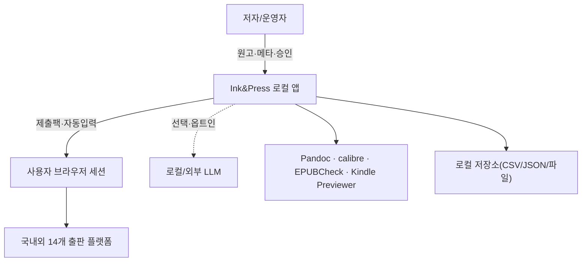
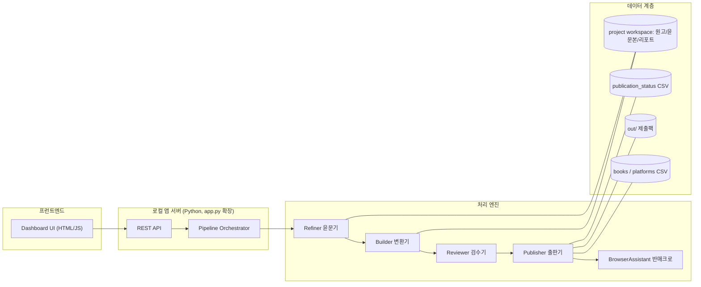
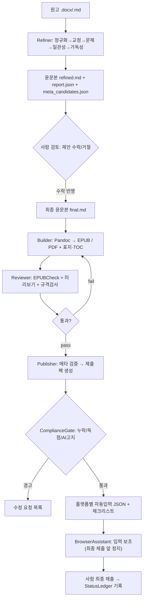

# 시스템 아키텍처 기술백서 — Ink&Press

작성일: 2026-06-08
문서 버전: v1.0

---

## 1. 목적

전자책 자동 출판·윤문기 통합 시스템의 **전체 구조, 모듈 경계, 데이터 흐름, 기술 선택과 그 근거, 배포·보안 모델**을 정의한다. 이 문서는 신규 윤문기를 기존 출판 MVP에 통합하는 청사진이다.

## 2. 아키텍처 원칙

1. **파이프라인 우선(Pipeline-first)**: 모든 처리는 *단계(stage)* 의 연결이며, 각 단계는 입력→산출물이 명확하다.
2. **로컬 우선(Local-first)**: 저작물인 원고는 기본적으로 로컬에서 처리. 외부 LLM은 옵트인.
3. **사람 게이트 명시(Human-in-the-loop)**: 의미 변경·법적 책임 지점은 데이터로 표시되고 UI에서 차단된다.
4. **추적 가능(Auditable)**: 모든 변경은 diff·근거·타임스탬프와 함께 남는다.
5. **느슨한 결합(Loose coupling)**: 윤문기, 변환기, 검수기, 출판기는 파일/JSON 계약으로 통신한다. 한 단계 교체가 다른 단계를 깨뜨리지 않는다.
6. **CSV/JSON 우선, DB는 나중**: 사람이 눈으로 보고 고칠 수 있게. 책이 100권을 넘으면 SQLite로 승격.

## 3. 시스템 컨텍스트(C4 - Level 1)



## 4. 컨테이너 구조(C4 - Level 2)



## 5. 핵심 모듈 (컴포넌트)

| 모듈 | 코드명 | 책임 | 입력 | 산출물 |
|---|---|---|---|---|
| 윤문기 | `Refiner` | 교정·문체·일관성·가독성·메타추출 | 원고(.docx/.md) | 윤문본 + 변경 리포트 + 메타 후보 |
| 변환기 | `Builder` | EPUB/PDF 생성, TOC/표지 결합 | 윤문본 + 메타 | `book.epub`, `book.pdf` |
| 검수기 | `Reviewer` | EPUBCheck·미리보기·규격 검사 | EPUB/표지 | 검수 리포트(pass/warn/fail) |
| 출판기 | `Publisher` | 플랫폼별 제출팩·자동입력 JSON | 메타 + 산출 파일 | `out/{book_id}/*.md|json` |
| 반매크로 | `BrowserAssistant` | 로그인 후 입력 보조, 최종 제출 정지 | 자동입력 JSON | 입력 완료(사람 제출) |
| 컴플라이언스 | `ComplianceGate` | AI고지·독점·필수항목·사람게이트 판정 | 메타+상태 | 게이트 결과/경고 |
| 상태장부 | `StatusLedger` | 책×플랫폼 진행상태 | 이벤트 | `publication_status.csv` |
| 오케스트레이터 | `Orchestrator` | 단계 연결·재실행·이력 | 명령 | 단계 결과/이력 |

> 굵게 신규: **Refiner, Builder, Reviewer, Orchestrator**. 나머지는 기존 MVP 자산을 모듈로 승격.

## 6. 엔드투엔드 데이터 흐름



## 7. 윤문기 내부 파이프라인 (요약)

상세는 `02_윤문기엔진_상세설계서.md`. 단계는 모두 멱등(idempotent)하고 추적 가능하다.


## 8. 기술 스택과 선택 근거

| 영역 | 선택 | 근거 | 대안/비고 |
|---|---|---|---|
| 앱 서버 | Python 3.11 표준 `http.server`(MVP)→ FastAPI(확장) | 의존성 최소, 기존 `app.py` 계승; 확장 시 비동기/검증 | Flask도 가능 |
| 프런트엔드 | 단일 HTML + 바닐라 JS | 설치 없이 로컬에서 즉시 실행 | 후속 React 가능 |
| 원고 변환 | **Pandoc** | DOCX/MD/HTML↔EPUB 표준, 안정적 | — |
| 전자책 변환 보조 | **calibre `ebook-convert`** | EPUB↔MOBI/PDF, 미리보기 | — |
| EPUB 표준검수 | **EPUBCheck**(+Java JRE) | W3C 표준 검증 | — |
| Kindle 검수 | Kindle Previewer | KDP 업로드 전 렌더 확인 | 선택 |
| EPUB 조작 | `ebooklib`, `lxml`, `bs4` | 이미 설치됨, TOC/메타 수정 | — |
| PDF | `PyMuPDF(fitz)`, `reportlab` | 추출·생성 | WeasyPrint 선택 |
| 이미지/표지 | `Pillow(PIL)` | 리사이즈/규격검사 | — |
| 브라우저 자동화 | **Playwright(Chromium)** | 별도 프로필 세션, 입력 보조 | Selenium 대안 |
| 윤문 규칙 | 한국어 규칙엔진 + 사용자 사전 | 로컬·결정적·추적 가능 | 형태소 분석기(KoNLPy/Kiwi) 보강 |
| 윤문 LLM(선택) | 로컬 LLM(Ollama 등) 또는 외부 API 옵트인 | 프라이버시, 비용 통제 | 외부는 익명화 후 |

> 현재 PC 점검 결과(`apps/ebook_publisher/toolchain_status.json`): Python·Playwright·ebooklib·bs4·lxml·fitz·reportlab·Pillow·Node·git·winget **설치됨**, **Pandoc/calibre/Java/WeasyPrint 미설치** → 설치 우선순위는 `04 기술스택 백서` 참조.

## 9. 자동화 레벨 정의

| 레벨 | 이름 | 설명 | 적용 단계 |
|---:|---|---|---|
| 0 | 수동 | 링크·체크리스트만 | 국내 입점 계약 |
| 1 | 자료 자동 생성 | 제출팩·리포트·윤문본 | Refiner/Publisher |
| 2 | 양식 자동 채움 | CSV/엑셀/PDF 신청서 | 국내 신청서 |
| 3 | 브라우저 자동 입력 | 로그인 이후 입력, 제출 앞 정지 | KDP 등 |
| 4 | API 제출 | 공식 API/승인된 대량 업로드 | 가능 플랫폼 한정 |
| 5 | 최종 제출 자동화 | **기본 금지**, 공식 API+명시 승인 시만 | — |

## 10. 배포·실행 모델

- **로컬 단일 사용자**가 기본. `127.0.0.1`에만 바인딩(외부 노출 금지).
- 실행기: Windows `*.ps1`, macOS/Linux는 `python3 app.py`.
- 워크스페이스 구조(프로젝트당):
```text
projects/{book_id}/
  source/manuscript.docx        # 원문(.gitignore 대상)
  refined/refined.md            # 윤문 산출
  refined/report.json           # 변경 리포트
  refined/meta_candidates.json  # 메타 후보
  build/book.epub, book.pdf     # 변환 산출(.gitignore)
  review/epubcheck.json         # 검수 리포트
  out/{platform}.md|json        # 제출팩
```

## 11. 보안·프라이버시 모델

- **금지**: 비밀번호/주민번호/계좌번호 평문 저장, CAPTCHA·본인인증 우회, 약관/독점 자동 클릭.
- **자격증명**: OS/브라우저 보안 저장소 사용. 저장소엔 "준비 완료 여부"만 기록.
- **브라우저 프로필**(`.chromium_profile/`)은 쿠키·로그인 데이터를 포함 → **버전관리 제외**(`.gitignore`).
- **원고 보호**: 외부 LLM 사용 시 옵트인 + 가능한 익명화, 기본은 로컬 처리.
- **감사 로그**: 윤문 수락/거절, 최종 제출 승인은 타임스탬프와 함께 기록.

## 12. 품질 속성(비기능 요구)

| 속성 | 목표 |
|---|---|
| 재현성 | 같은 입력·같은 규칙 → 같은 윤문 결과(LLM 미사용 시 결정적) |
| 성능 | 10만 자 원고 규칙 윤문 < 30초(로컬) |
| 이식성 | 핵심 로직 OS 비의존, 외부 도구는 어댑터로 격리 |
| 복원력 | 단계 실패 시 이전 산출물 보존·재시작 가능 |
| 관측성 | 단계별 상태/리포트 JSON 노출 |

## 13. 확장 로드맵 (아키텍처 관점)

1. `app.py`를 모듈형 라우터로 리팩터(`/api/refine`, `/api/build`, `/api/review` 추가).
2. Orchestrator 도입으로 단계 재실행·이력 관리.
3. Refiner를 규칙엔진→(옵션)로컬 LLM 하이브리드로.
4. 책 100권↑ 시 CSV→SQLite 마이그레이션(스키마는 `04` 유지).
5. 플랫폼 API 어댑터(가능한 곳)로 레벨 4 승격.
