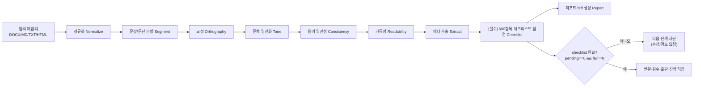

# 윤문기(Refiner) 엔진 상세설계서

작성일: 2026-06-08
문서 버전: v1.0
코드명: `Refiner`

---

## 1. 윤문기란

**윤문(潤文)** 은 글의 뜻을 유지하면서 문장을 다듬어 읽기 좋게 만드는 작업이다. 윤문기는 이를 단계별로 자동화하되, **원문 의미를 바꾸는 제안은 자동 확정하지 않고** 사람이 diff로 검토·수락하게 한다.

설계 신조:

> "교정은 과감하게, 윤문은 보수적으로, 의미 변경은 반드시 사람에게."

## 1.1 [필수] 600항목 윤문 체크리스트 적용 의무 (Hard Gate)

> **모든 윤문 실행은 `resources/checklist/checklist_600.json`(출판용 AI 원고 윤문·교정·교열 체크리스트 600)을 빠짐없이 적용해야 한다. 이는 권고가 아니라 강제 게이트다.**

- **단일 진실원**: 체크리스트 원본은 [`resources/checklist/윤문교정_체크리스트_600.md`](../resources/checklist/윤문교정_체크리스트_600.md). 기계 소비용 JSON은 `apps/ebook_publisher/scripts/build_checklist.py`로 생성한다(재현 가능).
- **전수 적용**: 윤문기는 매 실행마다 600개 항목 각각에 대해 **상태를 반드시 기록**한 `checklist_run.json`을 생성한다. 한 항목이라도 상태가 비어 있으면 윤문은 "미완료"다.
- **다음 단계 차단**: `checklist_run`이 완료(모든 항목이 `pass`/`na`/`waived`)되기 전에는 **변환(Builder)·검수(Reviewer)·출판(Publisher)으로 진행할 수 없다.** 구현은 `ComplianceGate`의 `checklist_incomplete` 게이트로 강제한다(`03`·`04` 참조).
- **항목 상태 값**: `pass`(충족) · `fail`(미충족, 수정 필요) · `na`(해당 없음, 사유 기록) · `waived`(사람이 명시적 면제, 사유·승인자 기록) · `pending`(미점검, 기본값).
- **`fail`이 하나라도 남으면 출판 차단.** `na`/`waived`는 반드시 사유를 남긴다(감사 추적).
- **검사 라우팅**(`suggested_method`): 각 항목은 자동/반자동/사람 검토로 분류된다.
  - `rules`(114) — 규칙엔진이 (반)자동 점검: 띄어쓰기·맞춤법·피동·부호·번역투 등.
  - `llm_review`(82) — LLM 보조 검토가 유효한 문맥 판단(AI 생성문·서사·실용서 톤 등).
  - `human_review`(352) — 사람의 최종 판단 필요(구조·논리·독자 경험·완성도).
  - `policy`(52) — 컴플라이언스·법무·권리·AI 고지·표절률 등.
- **분야 자동 적용**: 책 카테고리(수학/물리 전문서, 소설/에세이, 자기개발/실용서)에 맞는 분야별 항목 그룹이 자동으로 활성화된다. 비해당 항목은 `na`로 자동 표시하되 사유를 남긴다.
- **AI 고지 연동**: `policy` 그룹의 AI 생성 고지·표절률·저작권 항목 결과는 메타데이터 `ai_disclosure`와 출판기 게이트에 직접 반영된다.

## 2. 입력과 산출물 (계약)

### 입력
- 원고 파일: `.docx`, `.md`, `.txt`, `.html` 중 하나.
- 선택: 사용자 사전(`glossary.json`), 문체 프로파일(`style_profile.json`), 설정(`refine_config.json`).

### 산출물
```text
refined/refined.md            # 다듬은 본문(수락된 변경 반영)
refined/report.json           # 모든 제안의 목록·근거·수락여부
refined/diff.html             # 사람용 시각화 diff
refined/meta_candidates.json  # 제목/소개문/키워드/목차 후보
refined/readability.json      # 가독성 지표
refined/checklist_run.json    # [필수] 600항목 점검 결과(전수). 미완료 시 다음 단계 차단
```

### `checklist_run.json` 스키마(요약)
```json
{
  "book_id": "zerozone_001",
  "checklist_version": "1.0",
  "source": "resources/checklist/checklist_600.json",
  "generated_at": "2026-06-08T10:00:00+09:00",
  "total": 600,
  "counts": {"pass": 0, "fail": 0, "na": 0, "waived": 0, "pending": 600},
  "complete": false,
  "results": [
    {
      "id": "chk_001",
      "number": 1,
      "category": "원고 전체 구조",
      "method": "human_review",
      "status": "pending",        // pass|fail|na|waived|pending
      "evidence": "",             // 자동 점검 근거 또는 검토 메모
      "linked_suggestions": [],   // 관련 윤문 제안 id
      "reason": "",               // na/waived 시 필수
      "decided_by": "",           // waived 시 승인자
      "decided_at": ""
    }
  ]
}
```
`complete = (pending == 0 && fail == 0)`. `complete=false`이면 변환·검수·출판 불가.

### `report.json` 항목 스키마(요약)
```json
{
  "book_id": "zerozone_001",
  "generated_at": "2026-06-08T10:00:00+09:00",
  "engine": {"mode": "rules", "llm": null, "version": "1.0"},
  "stats": {"sentences": 4210, "suggestions": 318, "accepted": 0},
  "suggestions": [
    {
      "id": "s_000123",
      "category": "orthography",        // 카테고리(아래 6장)
      "severity": "auto|review|manual", // 자동확정/검토필요/사람전용
      "loc": {"para": 42, "char_start": 10, "char_end": 18},
      "before": "할수있다",
      "after": "할 수 있다",
      "reason": "의존명사 '수' 앞 띄어쓰기",
      "rule_id": "ko.spacing.dependent_noun",
      "confidence": 0.98,
      "status": "pending"               // pending|accepted|rejected
    }
  ]
}
```

## 3. 처리 파이프라인



각 단계는 **원문을 직접 덮어쓰지 않고 제안(suggestion) 목록을 누적**한다. 최종 `refined.md`는 *수락된* 제안만 반영해 생성한다. 따라서 단계는 멱등하고 되돌릴 수 있다.

## 4. 단계별 상세

### 4.1 입력 어댑터
- DOCX: Pandoc으로 Markdown 변환(`pandoc -f docx -t gfm`), 이미지/표 추출.
- HTML: `bs4`로 본문 추출, 태그 정리.
- 원본 구조(제목 레벨, 목록, 인용)를 Markdown 구조로 보존.

### 4.2 정규화 (Normalize)
- 유니코드 NFC 정규화, 전각→반각, 중복 공백/빈 줄 정리.
- 따옴표/말줄임표/대시 통일(`...`→`…`, `--`→`—` 옵션).
- 비가시 문자(ZWSP 등) 제거.

### 4.3 분할 (Segment)
- 문단/문장 단위 분할. (보강: 한국어 형태소 분석기 `Kiwi`/`KoNLPy`로 문장 경계 정확도 향상)
- 코드블록·인용·표는 윤문 대상에서 제외 표시.

### 4.4 교정 (Orthography) — `severity: auto` 중심
한국어 규칙 기반. 확신도 높은 항목은 자동 확정 후보.
- 띄어쓰기: 의존명사(수/것/때문), 보조용언, 단위 명사.
- 맞춤법: 자주 틀리는 어휘(되/돼, 안/않, 율/률, 로서/로써).
- 문장부호: 마침표/쉼표/따옴표 짝, 공백 규칙.
- 외래어 표기: 표기 사전 기반(옵션).

### 4.5 문체 일관화 (Tone) — `severity: review`
- 종결 어조 통일: 평서체(`-다`) vs 존댓말(`-습니다`) — 프로파일로 선택.
- 인칭/시제 일관성 점검.
- 군더더기/상투어 제거 제안("~에 대해서", 이중 부정, 불필요한 피동).

### 4.6 용어 일관성 (Consistency) — `severity: review`
- 사용자 사전(`glossary.json`)으로 인명·고유명사·전문용어 표기 통일.
  - 예: `리만 가설` vs `리만가설` → 사전의 정본으로 통일.
- 약어 최초 등장 시 풀어쓰기 권고.
- 표기 변동 자동 탐지(같은 개념의 표기 흔들림 클러스터링).

### 4.7 가독성 (Readability) — `severity: review`
- 지표: 평균 문장 길이, 과장문(40자↑) 비율, 피동/이중부정 빈도, 반복어, 문단 길이 분포.
- 너무 긴 문장 분할 제안, 어려운 표현 대안 제시.
- `readability.json`에 점수·분포·개선 포인트 기록.

### 4.8 메타 추출 (Extract)
윤문본에서 출판 메타데이터 후보를 추출해 뒷단으로 연결.
- 제목/부제: 최상위 제목 + 첫 절 요약.
- 목차(TOC): 제목 레벨 트리 → `toc.json`.
- 짧은/긴 소개문: 도입부·결론 기반 요약 후보(LLM 옵션 시 품질↑).
- 키워드: 빈도·고유명사·사전 기반 후보.
- 모두 **후보**일 뿐, 사람이 확정해 `book_metadata.csv`에 반영.

### 4.85 600항목 체크리스트 점검 (Checklist) — [필수]
- `resources/checklist/checklist_600.json`의 600개 항목을 **전수** 평가해 `checklist_run.json`을 만든다.
- `rules` 항목: 규칙엔진 결과로 자동 `pass`/`fail` 판정(근거 `evidence` 기록).
- `llm_review`/`human_review` 항목: 화면에 제시하고 사람(또는 LLM 보조)이 판정. 미판정은 `pending`.
- `policy` 항목: 컴플라이언스 입력(표절률·AI 고지·권리)과 연동해 판정.
- 책 분야에 비해당하는 항목은 `na`(+사유) 자동 처리.
- **종료 조건**: `pending==0 && fail==0` 이어야 `complete=true`가 되고 다음 단계가 열린다.

### 4.9 리포트/diff 생성 (Report)
- `report.json`, 사람용 `diff.html`(before/after 색상 표시) 생성.
- 카테고리별 일괄 수락/거절 지원.

## 5. 윤문 모드

| 모드 | 엔진 | 특징 | 프라이버시 |
|---|---|---|---|
| `rules` (기본) | 규칙엔진(+형태소) | 결정적·재현 가능·빠름 | 완전 로컬 |
| `local_llm` | 로컬 LLM(Ollama 등) | 문장 다듬기 품질↑ | 로컬, 외부 전송 없음 |
| `api_llm` (옵트인) | 외부 LLM API | 최고 품질, 비용 발생 | 옵트인·익명화 권장 |

LLM 사용 시에도 출력은 **제안**으로만 들어가며, `engine.llm` 메타와 함께 기록되어 **AI 사용 고지(`ai_disclosure`)** 추적에 반영된다.

## 6. 제안 카테고리와 기본 정책

| 카테고리 | code | 기본 severity | 자동 확정 |
|---|---|---|---|
| 교정(맞춤법/띄어쓰기/부호) | `orthography` | auto | 확신도 ≥ 0.95 시 추천 |
| 문체/어조 | `tone` | review | 아니오 |
| 용어 일관성 | `consistency` | review | 사전 정본 일치 시 추천 |
| 가독성 | `readability` | review | 아니오 |
| 의미 변경 가능 | `semantic` | manual | 절대 아니오 |
| 구조/목차 | `structure` | review | 아니오 |

> `manual`/`semantic`은 항상 사람이 직접 결정. 시스템은 절대 자동 반영하지 않는다.

## 7. 사용자 사전·문체 프로파일

### `glossary.json`
```json
{
  "terms": [
    {"canonical": "리만 가설", "variants": ["리만가설", "Riemann 가설"], "note": "정본 표기"},
    {"canonical": "제로존", "variants": ["ZeroZone", "제로 존"]}
  ]
}
```

### `style_profile.json`
```json
{
  "ending": "plain",          // plain(-다) | polite(-습니다)
  "person": "third",
  "max_sentence_len": 60,
  "passive_voice": "minimize",
  "quotes": "korean",         // “ ” 통일
  "ellipsis": "unicode"
}
```

## 8. API (로컬 앱 확장)

`01 아키텍처`의 서버에 추가되는 엔드포인트. 상세 스키마는 `04`.

| 메서드 | 경로 | 기능 |
|---|---|---|
| POST | `/api/refine/{book_id}` | 윤문 실행(모드/프로파일 지정) |
| GET | `/api/refine/{book_id}/report` | 제안 리포트 조회 |
| POST | `/api/refine/{book_id}/apply` | 선택한 제안 수락/거절 반영 |
| GET | `/api/refine/{book_id}/readability` | 가독성 지표 |
| GET | `/api/refine/{book_id}/meta` | 메타 후보 |
| GET | `/api/refine/{book_id}/checklist` | 600항목 점검 결과(`checklist_run`) 조회 |
| POST | `/api/refine/{book_id}/checklist` | 항목 상태 갱신(pass/fail/na/waived, 사유) |
| GET | `/api/refine/{book_id}/gate` | 체크리스트 완료 여부(다음 단계 진행 가능?) |

## 9. UI 흐름(윤문 화면)

```text
┌ 윤문 검토 ─────────────────────────────────────────────┐
│ 책: 제로존 001        모드: rules    제안 318건         │
│ [교정 245] [문체 41] [용어 22] [가독성 10] [구조 0]    │
├───────────────── diff ────────────────────────────────┤
│ - 할수있다는              + 할 수 있다는                │
│   근거: 의존명사 '수' 앞 띄어쓰기   확신도 0.98         │
│        [수락] [거절] [이 규칙 모두 수락]                │
├────────────────────────────────────────────────────────┤
│ [선택 수락] [카테고리 일괄] [되돌리기] [윤문본 저장]    │
└────────────────────────────────────────────────────────┘
```

색상 규칙은 `apps/ebook_publisher/02_UX_UI_상세설계서.md`와 통일(초록=확정, 노랑=검토, 빨강=위험).

## 10. 품질·안전 기준

- **과교정 방지**: 기본 보수적, `tone`/`semantic`은 자동 반영 금지.
- **되돌리기**: 모든 수락은 취소 가능(원문은 불변, 산출만 재생성).
- **재현성**: `rules` 모드는 동일 입력→동일 출력.
- **추적성**: 모든 제안에 `rule_id`/근거/확신도, 수락 이력 타임스탬프.
- **AI 고지 연동**: LLM 모드 사용 시 메타데이터의 `ai_disclosure`를 `ai_assisted`로 표시 권고.
- **체크리스트 전수 강제**: 600항목 모두 상태가 기록되어야 하며, `fail`/`pending`이 남으면 출판 차단. 테스트로 보장한다.

## 11. 테스트 전략

| 종류 | 내용 |
|---|---|
| 단위 | 규칙별 골든 케이스(입력→기대 제안) |
| 회귀 | 대표 원고 스냅샷 diff 비교(결정성 검증) |
| 가독성 | 지표 계산 정확도 |
| 통합 | 윤문→변환→검수 산출물 일관성 |
| 안전 | `semantic`/`manual` 자동 반영 0건 보장 |

## 12. 구현 단계 (Refiner 한정)

1. 입력 어댑터(DOCX/MD) + 정규화 + 분할.
2. **체크리스트 적재**: `build_checklist.py`로 `checklist_600.json` 생성 → `checklist_run` 초기화(600 pending).
3. 교정 규칙엔진(띄어쓰기·맞춤법·부호) + report.json/diff.html, `rules` 항목 자동 판정.
4. 수락/거절 반영 → refined.md 생성, `/api/refine` + `/api/refine/.../checklist` 연결.
5. 체크리스트 검토 UI + `gate` 강제(미완료 시 변환·출판 차단).
6. 문체·용어·가독성 모듈, 사용자 사전/프로파일.
7. 메타 추출 → 뒷단 출판 자동 연결.
8. (옵션) 로컬/외부 LLM 하이브리드로 `llm_review` 항목 보조 판정.
