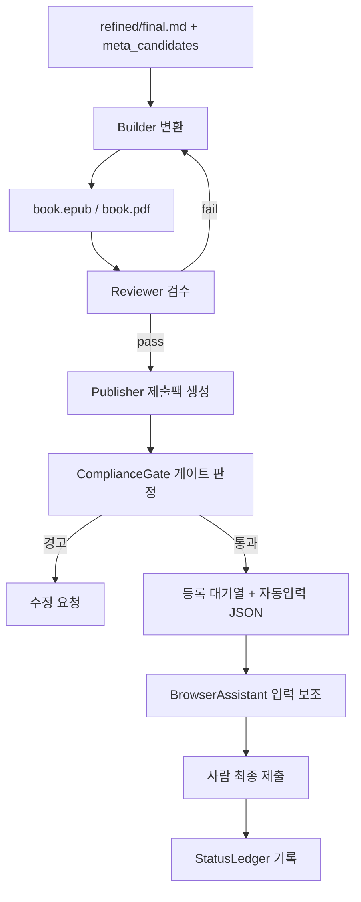
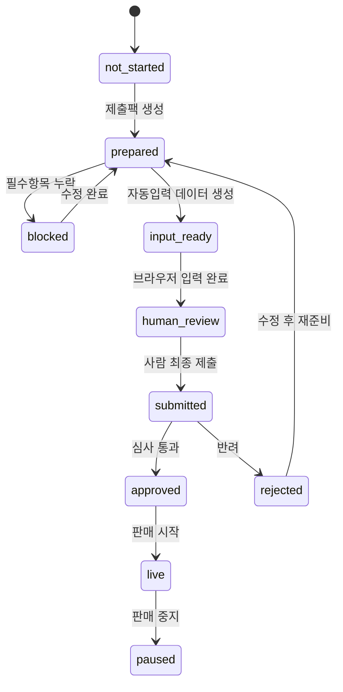

# 자동 출판 파이프라인 설계서 (변환·검수·등록)

작성일: 2026-06-08
문서 버전: v1.0

---

## 1. 범위

윤문기(`Refiner`) 산출물을 받아 **전자책 변환 → 표준 검수 → 플랫폼별 제출팩 생성 → 브라우저 자동 입력 보조 → 상태 기록**까지 잇는다. 등록 정책·플랫폼 전략의 원본은 `apps/ebook_publisher/00_원클릭_전자책출판_기술백서.md`이며, 본 문서는 이를 윤문기와 통합하는 관점으로 정리한다.

## 2. 전체 흐름



## 3. Builder (변환기)

### 책임
윤문본 + 메타데이터 → 표준 EPUB(우선) 및 PDF.

### 변환 규칙
- 1차: `pandoc -f gfm -t epub3 --toc --metadata title=... -o book.epub`.
- 표지: `Pillow`로 규격 검사 후 EPUB에 삽입(권장 1600×2560, RGB, JPG/PNG).
- TOC: 윤문기 `toc.json` 또는 제목 레벨에서 생성.
- PDF: `calibre ebook-convert book.epub book.pdf` 또는 `WeasyPrint`(옵션).
- 메타 주입: 제목/저자/언어/식별자(ISBN 있으면)를 EPUB OPF에 기록.

### 산출
```text
build/book.epub
build/book.pdf        # 선택
build/cover_checked.jpg
build/build_report.json
```

## 4. Reviewer (검수기)

### 책임
업로드 전에 오류를 잡는다. "등록 후 반려"를 "등록 전 수정"으로 옮긴다.

### 검사 항목
| 검사 | 도구 | 판정 |
|---|---|---|
| EPUB 표준 | EPUBCheck(+Java) | fail 시 등록 차단 |
| Kindle 렌더 | Kindle Previewer | warn |
| 표지 규격/해상도 | Pillow | warn/fail |
| 메타 일치(제목/저자) | 내부 비교 | warn |
| 깨진 링크/이미지 | ebooklib/bs4 | warn |
| 폰트 임베딩/용량 | 내부 | warn |

### 산출
```text
review/epubcheck.json    # {result: pass|warn|fail, messages:[...]}
review/review_summary.json
```

## 5. Publisher (출판기) — 기존 MVP 계승

### 책임
검수 통과 산출물 + 확정 메타데이터로 **플랫폼별 제출팩**을 만든다.
구현체: `apps/ebook_publisher/scripts/generate_submission_pack.py`.

### 산출(플랫폼당)
```text
out/{book_id}/{platform}.md     # 사람용 제출 체크리스트
out/{book_id}/{platform}.json   # 브라우저 자동입력/메타 데이터
out/submission_manifest.json    # 전체 매니페스트
```

### 플랫폼 레지스트리
14개 채널은 `apps/ebook_publisher/platform_registry.csv`에 정의. 자동화 수준별 분류:

| 자동화 수준 | 플랫폼 | 등록 전략 |
|---|---|---|
| `assisted_browser` | Amazon KDP, Google Play Books, Kobo, 네이버 스마트스토어, Gumroad, Payhip | 로그인 후 입력 보조, 최종 제출 사람 |
| `aggregator`/`manual_or_assisted` | Draft2Digital, PublishDrive, IngramSpark | 배급 허브, 중복 유통 주의 |
| `manual_contract` | 교보문고, YES24, 알라딘, 리디 | 입점 서류·신청서 자동 준비 |

## 6. ComplianceGate (안전 게이트)

등록 직전, 사람이 책임져야 할 항목과 위험을 강제로 표면화한다.

| 게이트 | 조건 | 동작 |
|---|---|---|
| `missing_required` | 제목/저자/소개문/가격/원고/표지 누락 | 차단 + 수정요청 |
| `exclusive_conflict` | KDP Select=on 인데 타 전자책 채널 등록 | 경고 + 사람 확인 |
| `ai_disclosure` | LLM 윤문 사용 또는 미검토 | 고지 상태 확인 요구 |
| `human_gate` | 약관/본인인증/세금/최종 제출 | 항상 사람 |

## 7. BrowserAssistant (반매크로)

구현체: `apps/ebook_publisher/scripts/semi_macro_browser.py` (Playwright, 별도 Chromium 프로필).

### 규칙(불변)
1. 로그인은 사용자가 직접. 자동화는 세션만 이용, 비밀번호 미취급.
2. 입력칸 매핑은 `mappings/`에 학습 저장(사이트별 셀렉터).
3. CAPTCHA·본인인증 출현 시 **즉시 정지**.
4. 약관 동의·독점/ KDP Select 체크박스 **자동 클릭 금지**.
5. **최종 제출 버튼 앞에서 정지**, 입력값 vs 원본 메타 검수표 표시.

### 모드
- `inspect`: 페이지 입력칸 인식만.
- `assist`: 제목/소개문/키워드/가격/파일칸 자동 입력 보조.

## 8. StatusLedger (상태 장부)

`apps/ebook_publisher/publication_status.csv`에 책×플랫폼 진행상태 누적.



## 9. 국내 vs 해외 전략 요약

- **해외**: KDP 직접 + Draft2Digital 배급 혼합. KDP Select 켜면 90일 독점 → 타 채널 충돌 관리.
- **국내**: 대형 서점은 출판사/공급사 입점 계약 중심 → 자동화 초점은 *신청서·도서정보서·가격표·담당자 메일 초안* 자동 준비.

## 10. 오케스트레이션(원클릭)

`Orchestrator`가 단계를 묶어 "원클릭 준비"를 제공한다. 각 단계는 독립 재실행 가능.

```text
refine → build → review → packs → (사람 검수) → assist → (사람 제출) → ledger
```

실패 시 해당 단계만 재시작하고 이전 산출물은 보존한다.

## 11. 구현 순서

1. Builder: Pandoc EPUB 변환 + 표지 검사(가장 큰 미통합 갭).
2. Reviewer: EPUBCheck 자동 실행·리포트.
3. Publisher 연동: 윤문 메타 → `book_metadata.csv` 자동 채움.
4. `/api/build`·`/api/review` 엔드포인트와 UI 버튼.
5. Orchestrator 원클릭.
6. 국내 신청서 자동 채움 모듈.
