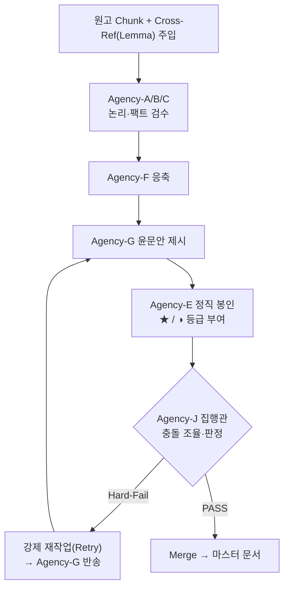
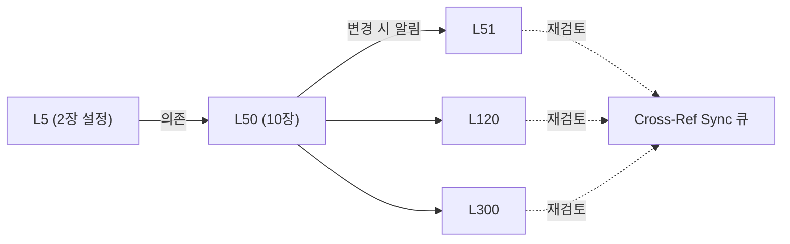
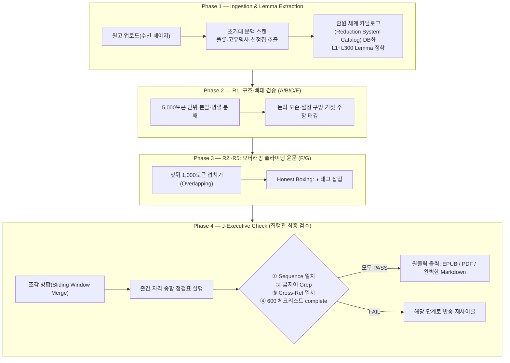

# 전자책 자동 윤문기 아키텍처 v2.0 — 제로존 방법론 통합 기술백서

작성일: 2026-06-08
문서 버전: v2.0
코드명: `Ink&Press v2 — Autonomous Publishing Engine`
적용 대상: 윤문기(Refiner) → 자율형 출판 엔진(Autonomous Editor)으로의 진화

---

## 0. 요지

v1 설계(`00`~`05`)는 "전체 이해 → 분할 윤문 → 병합"의 **선형 1회성** 파이프라인이었다.
v2.0은 제로존 이론서 집필·검증 방법론(다중 사이클, 7-에이전시, 정직 봉인, 크로스 레퍼런스 동기화)을 이식하여,
**오류율 0%를 지향하는 다중 에이전트·다중 사이클 자율 출판 엔진**으로 진화한다.

> 핵심 전환: "AI가 쓴 글은 맞다고 가정"(거짓 닫힘/False Closure)을 폐기하고,
> **"AI가 확신하지 못한 것을 인간에게 정직하게 보고"(Honest Boxing)** 를 1급 기능으로 삼는다.
> 인간 편집자는 전체를 재독하지 않고 `◑`(주의) 태그만 결재(Sign-off)한다.

이 백서는 v1을 대체하지 않고 **확장**한다. 600항목 체크리스트(`02 §1.1`)는 v2.0에서
집행관(Agency-J)의 출간 자격 점검표로 그대로 흡수된다.

## 1. 핵심 철학의 진화 (Lessons from Zero-Zone)

| # | 원리 | 제로존 원전 개념 | v2.0 시스템 이식 |
|---|---|---|---|
| 1 | **다중 사이클 누적 갱신** | R1~R65 반복 정련 | 한 번에 완성 포기, R1→Rn 레이어 누적 Refinement |
| 2 | **7-에이전시 분업·교차검증** | A/B/C/E/F/G/J 에이전시 | 역할 분리 AI 에이전트의 교차 검증·합의 |
| 3 | **정직 봉인(Honest Boxing)** | `★ 무조건` / `◑ 주의` | 확신/비확신 영역 분리 태깅 + 인간 결재 UI |
| 4 | **전수 동기화·닫힘 검증** | 메타 좌표(Lemma) 추적 | 의존성 그래프 기반 Cross-Ref 연쇄 동기화 |

> 출처 정합성: 본 방법론은 업로드된 AutoCoder/EORA 다중 에이전트 설계군의
> "코끼리 지도(Elephant Map)·다중 에이전트 팀·마스터 오케스트레이터" 개념과 동형이다.
> 자세한 출처는 [`../resources/methodology/제로존_방법론_출처.md`](../resources/methodology/제로존_방법론_출처.md).

## 2. 7-Agency 자율 검증 워크플로우 (Multi-Agent Debate)

제로존의 A,B,C,E,F,G,J 에이전시를 윤문 엔진의 AI 에이전트로 치환한다.

| 에이전트 | 역할 | 책임 | 600 체크리스트 연결 |
|---|---|---|---|
| **Agency-A/B/C** | 논리·팩트 검수 | 뼈대·인과관계·연도·전공지식(수학/물리/역사) 오류 | `논리와 주장`, `전문 이론서`, `사실 검증` |
| **Agency-E** | 정직성·윤리 (Honest Boxing) | 환각·저작권·거짓 닫힘(False Closure) 색출 → `◑` 태깅 | `AI 생성문 점검`, `사실 검증·출처·윤리`, `policy` |
| **Agency-F** | 응축·압축 | 중언부언·늘어짐 제거 | `문장 윤문`(가독성) |
| **Agency-G** | 편집·윤문 | 문체 일관성·오탈자·번역투 제거 | `문장 윤문`, `교정·조판` (`rules`) |
| **Agency-J** | 집행관(Master Orchestrator) | 권고안 취합·충돌 조율·PASS/FAIL 판정·Merge | `최종 독자 검수`, 출간 자격 종합 점검표 |



각 에이전트는 v1의 윤문 단계(교정/문체/일관성/가독성)와 매핑된다. 즉 v2.0은 v1 단계를
**역할별 에이전트로 분해하고, 사이클로 반복하며, 집행관이 합의**시키는 구조다.

## 3. 정직 봉인(Honest Boxing) 및 신뢰도 마커

윤문 결과물에 AI 스스로의 신뢰도를 마크다운 기호로 남겨 인간 검수를 돕는다.

| 마커 | 의미 | 처리 |
|---|---|---|
| `★` (무조건 통과) | 100% 확신: 단순 오탈자, 문맥상 완벽 | 자동 반영, 검수 생략 가능 |
| `◑` (Honest Boxing) | 원문 모호로 임의 해석, 팩트체크 필요 고유명사/수치 | **인간 결재 필수**. 원문 대조 UI 제공 |

- `◑` 태그는 `report.json`의 제안 및 `checklist_run.json` 항목과 링크된다.
- 인간 편집자의 1차 작업 = `◑`만 순회하며 Sign-off. 전체 재독 불필요.
- 마커는 데이터 모델 `honest_box`(`04 §3.8`)에 구조화 저장된다(본문 기호는 출판 전 제거/주석화).

## 4. 메타 좌표(Lemma) 기반 크로스 레퍼런스 동기화

수천 페이지에서 문맥 단절을 막기 위해 텍스트를 '글자'가 아닌 **의존성 그래프**로 관리한다.

1. **좌표 정착**: 책 전체의 주요 사건·인물·핵심 주장 ~300개를 추출해 `L1`~`L300` 메타 좌표(Lemma) 부여.
2. **의존성 추적**: 제10장(`L50`) 윤문 시, 제2장(`L5`)과 연결되면 프롬프트에 `L5` 요약본을 **강제 주입(Injection)**.
3. **연쇄 갱신(Cascade Sync)**: 10장에서 설정 변경 시, 연결된 모든 후속 좌표(`L51`~`L300`)에 '설정 변경 알림'을 보내 **전수 동기화** 유도.



데이터 표현: 노드=Lemma(좌표), 엣지=의존(`depends_on`/`affects`). 스키마는 `04 §3.9`.

## 5. Hard-Fail 정규식 게이트웨이 (출간 차단 사유)

제로존의 엄격 룰 기반 검증기(예: 금지어 '강제접힘' 본문 박힘 → 중증)를 이식한다.
AI가 텍스트를 생성한 **직후, 다음 단계로 넘어가기 전 반드시 통과**해야 하는 관문이다.

| 검증 항목 | 예시 | 판정 |
|---|---|---|
| 금지어/AI 상투어 | "결론적으로 말하자면", "요약하자면", "중요한 것은" | Hard-Fail |
| 괄호/따옴표 불일치 | `(`/`)`, `“`/`”`, `[`/`]` 짝 안 맞음 | Hard-Fail |
| 마크다운 태그 깨짐 | 닫히지 않은 `**`, 코드펜스, 표 | Hard-Fail |
| 빈 페이지/빈 청크 | 내용 없음 | Hard-Fail |
| 서지 정보 누락 | 제목/저자/ISBN 자리 비어있음 | Hard-Fail(메타 단계) |
| 정직 봉인 누락 | 임의 해석인데 `◑` 없음 | Warn→재검토 |

- 하나라도 FAIL → 해당 Chunk는 **Agency-G로 반송, 강제 재작업(Retry)**.
- 구현체: **실제 동작하는 린터** [`../apps/ebook_publisher/scripts/lint_text.py`](../apps/ebook_publisher/scripts/lint_text.py),
  금지어 사전 [`../resources/hardfail/forbidden_terms.json`](../resources/hardfail/forbidden_terms.json).
- 600 체크리스트의 `rules`·AI생성문 항목과 정합.

## 6. v2.0 파이프라인 (The Elephant Map)

거대한 코끼리를 만지듯 전체(Global)와 부분(Local)을 오가며 N 사이클을 돈다.



### 사이클 정책
- **R1**: 글을 다듬기 전 **논리부터** 고정(구조 검증). 윤문 금지.
- **R2~R5**: 본격 윤문, 오버래핑 슬라이딩으로 문맥 연속성 유지, 정직 봉인 작동.
- **Rn(추가)**: 잔여 `◑`/`fail`이 임계치 이하가 될 때까지 반복(수렴 조건은 `05` DoD).

## 7. 추천 기술 스택

| 영역 | 선택 | 근거 | v1과의 관계 |
|---|---|---|---|
| 멀티 에이전트 | **AutoGen** 또는 **CrewAI** | 에이전트 간 대화·합의·도구 실행 표준 | v1 규칙엔진 위에 에이전트 계층 추가 |
| 지식 그래프(Lemma) | **Neo4j** + **LlamaIndex** | 벡터 검색이 아닌 '관계' 추적 필요 | v1 CSV/JSON → 그래프로 승격(대형 원고) |
| 초거대 문맥 스캔 | 장문맥 LLM(로컬/외부 옵트인) | Phase 1 전체 스캔 | `02` LLM 모드 확장 |
| Hard-Fail 린터 | 자체 `lint_text.py`(정규식) | 결정적·로컬·빠름 | 신규 구현(본 백서 동반) |

> 점진 도입 원칙: 소형 원고는 v1(규칙엔진+CSV)로 충분. **대형·고정합 원고**에서만
> AutoGen/Neo4j 계층을 켠다(설정 `engine.mode = "v2_multiagent"`).

## 8. 핵심 로직 (참조 의사코드)

7-Agency 합의 + 정직 봉인 + Hard-Fail 재시도. 실제 린터(`lint_text`)는 구현되어 있다.

```python
import autogen
from lint_text import lint_text  # 실제 구현: apps/ebook_publisher/scripts/lint_text.py

agency_g_editor = autogen.AssistantAgent(
    name="Agency-G_Editor",
    system_message="당신은 문체와 가독성을 담당하는 편집자입니다. 매끄럽게 윤문하세요.")

agency_e_honesty = autogen.AssistantAgent(
    name="Agency-E_Honesty",
    system_message=("당신은 팩트체크·정직성 담당입니다. 윤문이 원문 의미를 훼손했거나 "
                    "환각이 의심되면 문장 뒤에 [◑ honest 박싱] 태그와 사유를, 완벽하면 [★ 무조건] 태그를 붙이세요."))

agency_j_executive = autogen.UserProxyAgent(
    name="Agency-J_Executive",
    system_message="집행관입니다. 의견을 취합해 최종 본문을 확정하고 출간 차단 사유를 점검합니다.",
    human_input_mode="NEVER", max_consecutive_auto_reply=3)

def process_chunk(chunk_id, text_chunk, cross_ref_context, depth=0):
    prompt = f"""
    [현재 좌표 ID]: {chunk_id}
    [연결된 과거 설정(Cross-Ref)]: {cross_ref_context}
    [윤문할 원문]:
    {text_chunk}
    작업: 1) Agency-G 윤문안 2) Agency-E 정직 봉인(★/◑) 3) Agency-J 최종 승인
    """
    groupchat = autogen.GroupChat(
        agents=[agency_j_executive, agency_g_editor, agency_e_honesty], messages=[], max_round=5)
    manager = autogen.GroupChatManager(groupchat=groupchat)
    agency_j_executive.initiate_chat(manager, message=prompt)
    final_text = agency_j_executive.last_message()["content"]

    report = lint_text(final_text)           # Hard-Fail 게이트
    if not report.ok and depth < 3:          # 무한루프 방지: 최대 재시도
        return process_chunk(chunk_id, text_chunk, cross_ref_context, depth + 1)
    return final_text
# 이후 모든 Chunk를 Sliding Window 병합 → 마스터 문서
```

## 9. 결론 — "반증 가능성과 정직성의 소프트웨어화"

기존 AI 윤문기는 결과를 무조건 맞다고 가정해 뱉어낸다(거짓 닫힘).
v2.0은 제로존 철학을 이어받아 **"AI가 고치지 못한 것·확신하지 못하는 것을 정직하게 보고"** 하는 기능을 핵심으로 둔다.
수천 페이지를 처리해도 인간은 `◑` 태그만 순회·결재하면 된다. 이것이 진정한 **출판 자격 도달(PASS)** 을 가능케 하는 초격차 아키텍처다.

## 10. v1 → v2.0 통합 체크리스트(구현 게이트)

- [ ] 7-에이전시 역할 정의 및 600 체크리스트 카테고리 매핑 테이블 확정(`§2`)
- [ ] Honest Boxing 마커(★/◑) 데이터 모델·UI 결재 화면(`04 §3.8`)
- [ ] Lemma 추출 + 의존성 그래프 + Cascade Sync(`04 §3.9`)
- [ ] Hard-Fail 린터 `lint_text.py` + 금지어 사전(동반 구현 완료)
- [ ] 다중 사이클 오케스트레이션(R1 구조 → R2~5 윤문 → J-check)
- [ ] 집행관 출간 자격 점검표 = (Sequence + 금지어 + Cross-Ref + 600 complete)
- [ ] `engine.mode` 토글(v1 규칙 / v2 멀티에이전트)

세부 일정은 [`05_개발로드맵_및_품질기준.md`](05_개발로드맵_및_품질기준.md) M5~M6 참조.
