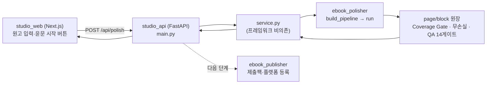

# OneClick eBook Studio 통합 (제품 셸 ↔ 엔진 배선)

작성일: 2026-06-08
문서 버전: v1.0

---

## 1. 배경

`sooasim/oneclick-ebook-studio` 저장소를 분석한 결과, 다음으로 구성된 **v0 제품 셸**이었다.

- `apps/studio-api/main.py` — FastAPI 스켈레톤. `/health`, `/api/projects`, `/api/compose/start`가
  모두 **더미(TODO)** 반환.
- `apps/studio-web/` — `create-next-app` 보일러플레이트(실 UI 없음).
- 나머지 ~3600개 파일 — 번들된 Python 가상환경(`.pyc`/`.exe`/`dist-info`/numpy·scipy 컴파일 산출).

즉 스튜디오는 **껍데기(셸)** 이고, 실제 윤문/출판 **엔진은 본 저장소**(`apps/ebook_polisher`,
`apps/ebook_publisher`)에 있다. 따라서 통합 방향은 **셸을 가져와 엔진에 실제로 배선**하는 것이다.

## 2. 가져온 것 / 버린 것

| 구분 | 처리 |
|---|---|
| `studio-api/main.py` 구조·엔드포인트 | **계승** → `apps/studio_api/`로, 더미를 실제 엔진 호출로 교체 |
| `studio-api` requirements/Dockerfile/.tool-versions | 계승 |
| `studio-web` Next.js 스캐폴드(설정·layout·public) | 계승 → `apps/studio_web/` |
| `studio-web/app/page.tsx` 보일러플레이트 | **실 UI로 교체**(원고 입력→윤문→coverage/QA/결과) |
| 번들 venv(.pyc/.exe/dist-info/site-packages 등) | **제외**(저장소 오염 방지, `.gitignore`) |

## 3. 통합 아키텍처



핵심: **셸의 더미 응답이 사라지고**, `/api/polish`·`/api/compose/start`가 실제로
원장 기반 무손실 엔진을 실행해 coverage·QA·윤문본을 반환한다.

## 4. 엔드포인트 매핑

| 원본(더미) | 통합 후(실제) |
|---|---|
| `POST /api/projects` → `{project_id:"demo-1"}` 고정 | 프로젝트 저장소에 생성, 고유 id, 검증 |
| `POST /api/compose/start` → `{status:"started"}` 고정 | 원고 있으면 **윤문 파이프라인 실행**, 결과·상태 저장 |
| (없음) | `POST /api/polish` 신설 — 텍스트→윤문본+coverage+QA |

## 5. 계층 분리(테스트 용이성)

- `service.py`는 **FastAPI 없이** 동작 → `python3 -m unittest`로 엔진 배선까지 검증(7 tests).
- `main.py`는 HTTP 바인딩·CORS만 담당.
- 따라서 CI/로컬에서 무거운 의존성 없이 핵심 로직을 검증한다.

## 6. 실행

```bash
# 1) API (엔진 배선)
cd apps/studio_api && pip install -r requirements.txt && uvicorn main:app --port 8000
# 2) 웹
cd apps/studio_web && npm install && npm run dev   # http://localhost:3000
```

웹에서 원고를 넣고 `윤문 시작` → API가 엔진을 실행 → 출판가능/커버리지/QA 배지와 윤문본 표시.

## 7. 다음 단계

- `/api/compose/start`에 변환(EPUB/PDF)·`ebook_publisher` 제출팩 생성을 연결(원클릭 출판).
- 프로젝트 저장소 CSV/SQLite 영속화, 진행 상태 스트리밍(WebSocket).
- 파일 업로드(DOCX/PDF/EPUB) → 엔진 파서 연동(E2).
